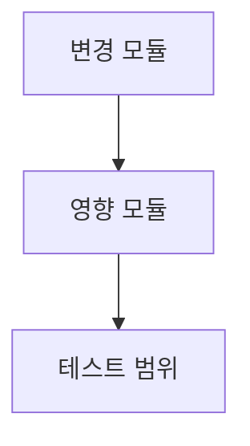

# /plan — 구현 계획 수립

> 파이프라인 위치: **[plan]** → review → ship → qa → investigate → retro

## Use This Skill When

- 코딩 시작 전이고 범위, 승인, 아키텍처 정의가 주 작업일 때
- 사용자가 구현 방법이나 실행 전 계획 문서를 요청할 때
- 파일 변경, 의존성, Mermaid 다이어그램, 테스트 전략을 작업 전에 정리해야 할 때

## Prefer Another Skill When

- 계획+구현+릴리스까지 한 번에: `mstack-pipeline` 사용
- 코드/diff가 이미 있고 검토가 필요: `mstack-review` 사용
- 검증만 필요: `mstack-qa` 사용

## 왜 2-Phase인가

계획을 한 번에 쏟아내면 비즈니스 담당자는 기술 세부사항에 묻히고,
엔지니어는 "왜 이걸 하는지"를 놓친다.
Phase를 나누면 승인 병목이 줄고, 각 독자가 자기 관심사만 빠르게 검토할 수 있다.

---

## Phase 1 — CEO Review (비즈니스 한 장)

아래 섹션을 **한 페이지 이내**로 작성한다.

### 1.1 문제 정의
- 현재 상태 vs 목표 상태를 한 문장으로
- 영향 범위: 사용자 수, 매출, SLA 등 정량 지표

### 1.2 제안 옵션
최소 2개, 최대 3개 옵션을 표로 비교:

| 옵션 | 설명 | 공수(일) | 리스크 | 비용(AED) |
|------|------|---------|--------|----------|
| A    |      |         |        |          |
| B    |      |         |        |          |

### 1.3 추천 & 근거
- 추천 옵션과 이유를 3줄 이내로
- 실패 시 롤백 전략 한 줄

### 1.4 승인 요청
`[ ] Phase 1 승인` 체크박스를 남긴다.
승인 전까지 Phase 2로 진행하지 않는다 — 단, 사용자가 "둘 다 써줘"라고 하면 한 번에 작성해도 된다.

---

## Phase 2 — Engineering Review (기술 상세)

### 2.1 Mermaid 아키텍처 다이어그램 (필수)

변경되는 모듈 간 관계를 Mermaid `graph TD` 또는 `sequenceDiagram`으로 그린다.
이 다이어그램이 없으면 리뷰어가 전체 맥락을 파악할 수 없으므로 반드시 포함한다.

### 2.2 파일 변경 목록

| 파일 | 변경 유형 | 설명 |
|------|----------|------|
| `src/foo.py` | modify | 함수 X 추가 |
| `tests/test_foo.py` | create | X에 대한 단위 테스트 |

> **⚠️ 파일명 충돌 체크포인트**: `create` 유형의 파일은 이미 동일 이름이 존재하는지 확인하라.
> 충돌 시 대안 파일명을 Plan에 명시하여 SUBAGENT가 독자적으로 파일명을 결정하는 것을 방지한다.

### 2.3 의존성 & 순서
- 작업 간 의존 관계를 명시 (A가 끝나야 B 가능 등)
- Agent Teams 사용 시: 팀원별 할당 디렉토리와 작업 순서

### 2.4 테스트 전략
- 단위 테스트: 어떤 함수/메서드를 커버하는지
- 통합 테스트: 필요 여부와 범위
- 기존 테스트 중 깨질 가능성이 있는 것

### 2.5 리스크 & 완화
- 기술 리스크 (성능, 호환성, 보안) 각각 한 줄
- 완화 전략

---

## 출력 형식

계획 문서를 `plan.md`로 저장한다 (이미 존재하면 날짜 접미사 추가).
Agent Teams 프롬프트에서 사용할 경우 `.claude-prompts/` 아래에도 복사한다.

## 파이프라인 연결

계획이 승인되면 사용자에게 다음 단계를 안내한다:
> "계획이 확정되었습니다. `/review`로 코드 리뷰 체크리스트를 준비하거나, 바로 구현을 시작하시겠습니까?"

## /careful 연동

`/careful` 스킬이 활성화되어 있으면:
- Phase 2 작성 시 공유 모듈(src/shared/ 등) 변경 여부를 자동 체크
- 해당 시 `⚠️ 공유 모듈 변경 — 리드 승인 필요` 경고를 삽입
