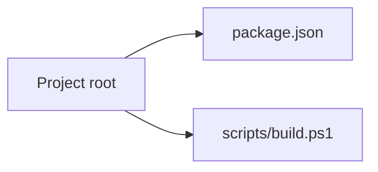

<!-- PROJECT-DOC-ORCHESTRATOR:MANAGED -->
<!-- PROJECT-DOC-ORCHESTRATOR:MANAGED-START -->
# Observed Architecture For smoke-doc-app

## Architecture Rule
This architecture view is derived from inspected manifests, scripts, source layout, and docs. If there is not enough evidence, the gaps are stated plainly.

## Architecture Diagram

## Observed Architecture Notes
- The project exposes 1 inspected manifest/config file(s) that define its tooling surface.
- The project exposes 1 inspected runnable script file(s) in root/script locations.
- There are 2 inspected documentation file(s) that may describe or duplicate current behavior.

## Manifest Surface
- `package.json`: npm package with 2 script(s)

## Automation Surface
- `scripts/build.ps1`: Write-Output "building smoke docs"

## Evidence Files
- `README.md`
- `docs/usage.md`
- `package.json`
- `scripts/build.ps1`

## Refresh Metadata
- Generated at: `2026-03-30T04:22:48+00:00`
<!-- PROJECT-DOC-ORCHESTRATOR:MANAGED-END -->

<!-- PROJECT-DOC-ORCHESTRATOR:PRESERVE-START -->
Add notes here if you need human-authored content preserved across refreshes.
Do not remove the preserve markers.
<!-- PROJECT-DOC-ORCHESTRATOR:PRESERVE-END -->
