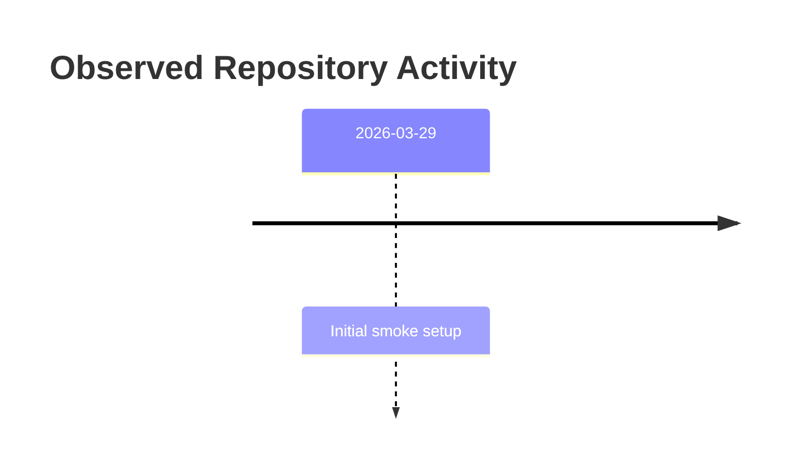

<!-- PROJECT-DOC-ORCHESTRATOR:MANAGED -->
<!-- PROJECT-DOC-ORCHESTRATOR:MANAGED-START -->
# Observed Changelog For smoke-doc-app

## Changelog Rule
This file records observable project history from git metadata and documentation refresh events. It does not manufacture release notes.

## Activity Diagram

## Recent Commits
- `2026-03-29` `fe5517b` Initial smoke setup

## Current Working Tree Signals
- ` M docs/usage.md`
- ` M src/main.py`
- `?? docs/project-docs/`
- `?? snapshot.json`

## Documentation Refresh
- `2026-03-30` Managed docs refreshed from current repository inspection.

## Evidence Files
- `README.md`
- `docs/usage.md`
- `package.json`
- `scripts/build.ps1`
<!-- PROJECT-DOC-ORCHESTRATOR:MANAGED-END -->

<!-- PROJECT-DOC-ORCHESTRATOR:PRESERVE-START -->
Add notes here if you need human-authored content preserved across refreshes.
Do not remove the preserve markers.
<!-- PROJECT-DOC-ORCHESTRATOR:PRESERVE-END -->
