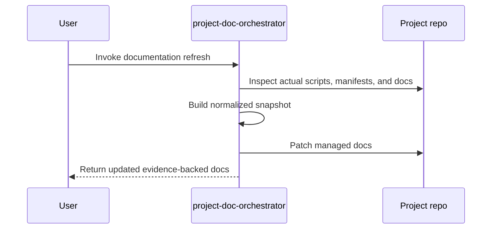

<!-- PROJECT-DOC-ORCHESTRATOR:MANAGED -->
<!-- PROJECT-DOC-ORCHESTRATOR:MANAGED-START -->
# Working Guide For smoke-doc-app

## Guide Rule
Only commands and workflows verified from inspected manifests, scripts, and docs are included below.

## Guide Diagram

## Commands You Can Run
- `npm run docs`
- `npm run start`
- `powershell -ExecutionPolicy Bypass -File C:/Users/SAMSUNG/Downloads/skill/tmp-doc-orchestrator-parallel-test-20260330/scripts/build.ps1`

## Script Entry Points
- `scripts/build.ps1`: Write-Output "building smoke docs"

## Documentation Inputs
- `README.md`: Smoke Doc App
- `docs/usage.md`: Notes

## Evidence Files
- `README.md`
- `docs/usage.md`
- `package.json`
- `scripts/build.ps1`

## Refresh Metadata
- Generated at: `2026-03-30T04:22:48+00:00`
<!-- PROJECT-DOC-ORCHESTRATOR:MANAGED-END -->

<!-- PROJECT-DOC-ORCHESTRATOR:PRESERVE-START -->
Add notes here if you need human-authored content preserved across refreshes.
Do not remove the preserve markers.
<!-- PROJECT-DOC-ORCHESTRATOR:PRESERVE-END -->
