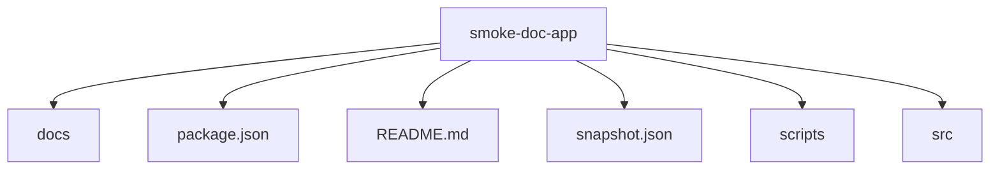

<!-- PROJECT-DOC-ORCHESTRATOR:MANAGED -->
<!-- PROJECT-DOC-ORCHESTRATOR:MANAGED-START -->
# Repository Layout For smoke-doc-app

## Layout Rule
This layout reflects the current filesystem inspection, not an assumed project template.

## Layout Diagram


## Tree Snapshot
```text
tmp-doc-orchestrator-parallel-test-20260330/
|-- docs/
|   |-- project-docs/
|   |   |-- ARCHITECTURE.md
|   |   |-- CHANGELOG.md
|   |   |-- GUIDE.md
|   |   |-- LAYOUT.md
|   |   |-- PLAN.md
|   |   \-- README.md
|   \-- usage.md
|-- scripts/
|   \-- build.ps1
|-- src/
|   \-- main.py
|-- package.json
|-- README.md
\-- snapshot.json
```

## Top-Level Entry Counts
- `docs`: 7 item(s)
- `package.json`: 1 item(s)
- `README.md`: 1 item(s)
- `snapshot.json`: 1 item(s)
- `scripts`: 1 item(s)
- `src`: 1 item(s)

## Files Used To Infer Layout
- `README.md`
- `docs/usage.md`
- `package.json`
- `scripts/build.ps1`

## Refresh Metadata
- Generated at: `2026-03-30T04:22:48+00:00`
<!-- PROJECT-DOC-ORCHESTRATOR:MANAGED-END -->

<!-- PROJECT-DOC-ORCHESTRATOR:PRESERVE-START -->
Add notes here if you need human-authored content preserved across refreshes.
Do not remove the preserve markers.
<!-- PROJECT-DOC-ORCHESTRATOR:PRESERVE-END -->
