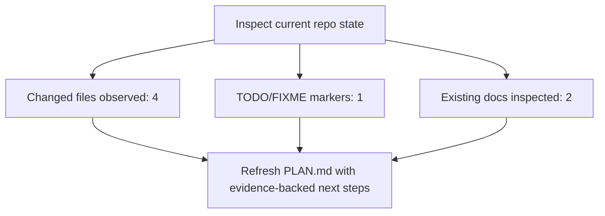

<!-- PROJECT-DOC-ORCHESTRATOR:MANAGED -->
<!-- PROJECT-DOC-ORCHESTRATOR:MANAGED-START -->
# Current Plan For smoke-doc-app

## Planning Rule
This plan only uses observed repository state, TODO markers, git activity, and inspected scripts/docs. It does not invent backlog items.

## Plan Diagram

## Evidence-Backed Next Actions
- Review and document the 4 changed file(s) already visible in git status.
- Triaging TODO/FIXME markers is evidence-backed work that can be planned immediately.
- Validate the inspected runnable scripts and keep GUIDE.md aligned with their real invocation shape.
- Keep setup and architecture documentation synchronized with the inspected manifest files.

## TODO And FIXME Evidence
- `src/main.py:2` # TODO: replace smoke placeholder with the real app entrypoint

## Recent Activity Considered
- `2026-03-29` `fe5517b` Initial smoke setup

## Evidence Files
- `README.md`
- `docs/usage.md`
- `package.json`
- `scripts/build.ps1`

## Refresh Metadata
- Generated at: `2026-03-30T04:22:48+00:00`
<!-- PROJECT-DOC-ORCHESTRATOR:MANAGED-END -->

<!-- PROJECT-DOC-ORCHESTRATOR:PRESERVE-START -->
Add notes here if you need human-authored content preserved across refreshes.
Do not remove the preserve markers.
<!-- PROJECT-DOC-ORCHESTRATOR:PRESERVE-END -->
