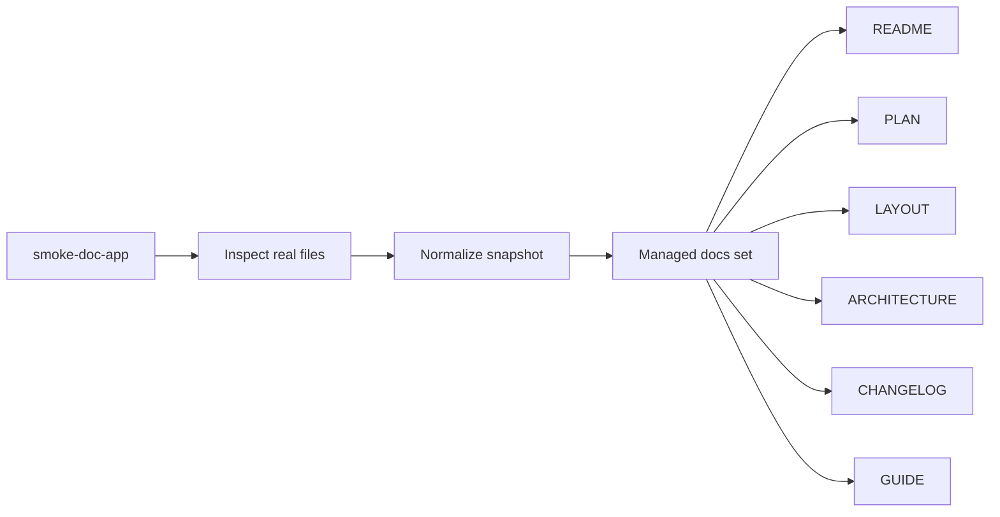

<!-- PROJECT-DOC-ORCHESTRATOR:MANAGED -->
<!-- PROJECT-DOC-ORCHESTRATOR:MANAGED-START -->
# smoke-doc-app

> Managed by `project-doc-orchestrator`. This file is regenerated from inspected repository evidence.

## Purpose
High-level project summary based on inspected files.

## Evidence Rule
This document was generated only after reading real manifests, scripts, and docs from the project. Missing evidence is called out instead of guessed.

## Overview Diagram

## Observations
- Detected 1 manifest/config file(s).
- Inspected 1 runnable script file(s).
- Inspected 2 existing documentation file(s).
- Git repository detected on branch master with 1 recent commit(s).
- Found 1 TODO/FIXME-style marker(s) in inspected text files.

## Inspected Manifests
- `package.json`: npm package with 2 script(s)

## Inspected Scripts
- `scripts/build.ps1`: Write-Output "building smoke docs"

## Existing Docs
- `README.md`: Smoke Doc App
- `docs/usage.md`: Notes

## Commands Derived From Inspected Files
- `npm run docs`
- `npm run start`
- `powershell -ExecutionPolicy Bypass -File C:/Users/SAMSUNG/Downloads/skill/tmp-doc-orchestrator-parallel-test-20260330/scripts/build.ps1`

## Evidence Files
- `README.md`
- `docs/usage.md`
- `package.json`
- `scripts/build.ps1`

## Refresh Metadata
- Generated at: `2026-03-30T04:22:48+00:00`
- Project root: `C:\Users\SAMSUNG\Downloads\skill\tmp-doc-orchestrator-parallel-test-20260330`
<!-- PROJECT-DOC-ORCHESTRATOR:MANAGED-END -->

<!-- PROJECT-DOC-ORCHESTRATOR:PRESERVE-START -->
Preserve me across refreshes.
<!-- PROJECT-DOC-ORCHESTRATOR:PRESERVE-END -->
