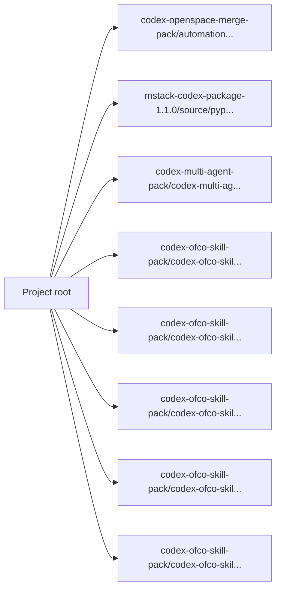

<!-- PROJECT-DOC-ORCHESTRATOR:MANAGED -->
<!-- PROJECT-DOC-ORCHESTRATOR:MANAGED-START -->
# Observed Architecture For Skill Workspace

## Architecture Rule
This architecture view is derived from inspected manifests, scripts, source layout, and docs. If there is not enough evidence, the gaps are stated plainly.

## Architecture Diagram

## Observed Architecture Notes
- The project exposes 2 inspected manifest/config file(s) that define its tooling surface.
- The project exposes 30 inspected runnable script file(s) in root/script locations.
- There are 31 inspected documentation file(s) that may describe or duplicate current behavior.

## Manifest Surface
- `codex-openspace-merge-pack/automation/requirements.txt`: Python requirements list with 3 package(s)
- `mstack-codex-package-1.1.0/source/pyproject.toml`: Python project manifest with 1 script entrypoint(s)

## Automation Surface
- `codex-multi-agent-pack/codex-multi-agent-pack/.agents/skills/scenario-scorer/scripts/score_options.py`: """Deterministic weighted scenario scorer.; Usage:
- `codex-ofco-skill-pack/codex-ofco-skill-pack/.codex/skills/cost-center-mapper/scripts/run.py`: import json; import re
- `codex-ofco-skill-pack/codex-ofco-skill-pack/.codex/skills/flow-code-validator/scripts/run.py`: import json; import sys
- `codex-ofco-skill-pack/codex-ofco-skill-pack/.codex/skills/invoice-match-verify/scripts/run.py`: import json; import math
- `codex-ofco-skill-pack/codex-ofco-skill-pack/.codex/skills/ofco-lines-export/scripts/run.py`: import csv; import json
- `codex-ofco-skill-pack/codex-ofco-skill-pack/.codex/skills/vendor-invoice-grouping/scripts/run.py`: import json; import sys
- `codex-skill-update-pack/.agents/skills/skill-update/scripts/build_update_plan.py`: from __future__ import annotations; import argparse
- `codex-skill-update-pack/.agents/skills/skill-update/scripts/scan_skill_graph.py`: from __future__ import annotations; import argparse
- `codex-skill-update-pack/.agents/skills/skill-update/scripts/validate_outputs.py`: from __future__ import annotations; import argparse
- `design-upgrade-loop-package/design-upgrade-loop-package/.agents/skills/design-upgrade-loop/scripts/validate_design_scorecard.py`: """Validate a design-upgrade scorecard and print a PASS/FAIL summary.; Usage:

## Evidence Files
- `README.md`
- `codex-multi-agent-pack/codex-multi-agent-pack/.agents/skills/scenario-scorer/scripts/score_options.py`
- `codex-ofco-skill-pack/codex-ofco-skill-pack/.codex/skills/cost-center-mapper/scripts/run.py`
- `codex-ofco-skill-pack/codex-ofco-skill-pack/.codex/skills/flow-code-validator/scripts/run.py`
- `codex-ofco-skill-pack/codex-ofco-skill-pack/.codex/skills/invoice-match-verify/scripts/run.py`
- `codex-ofco-skill-pack/codex-ofco-skill-pack/.codex/skills/ofco-lines-export/scripts/run.py`
- `codex-ofco-skill-pack/codex-ofco-skill-pack/.codex/skills/vendor-invoice-grouping/scripts/run.py`
- `codex-ofco-skill-pack/codex-ofco-skill-pack/README.md`
- `codex-openspace-merge-pack/README.md`
- `codex-openspace-merge-pack/automation/requirements.txt`
- `codex-skill-update-pack/.agents/skills/skill-update/scripts/build_update_plan.py`
- `codex-skill-update-pack/.agents/skills/skill-update/scripts/scan_skill_graph.py`

## Refresh Metadata
- Generated at: `2026-04-03T17:14:40+00:00`
<!-- PROJECT-DOC-ORCHESTRATOR:MANAGED-END -->

<!-- PROJECT-DOC-ORCHESTRATOR:PRESERVE-START -->
Add notes here if you need human-authored content preserved across refreshes.
Do not remove the preserve markers.
<!-- PROJECT-DOC-ORCHESTRATOR:PRESERVE-END -->
