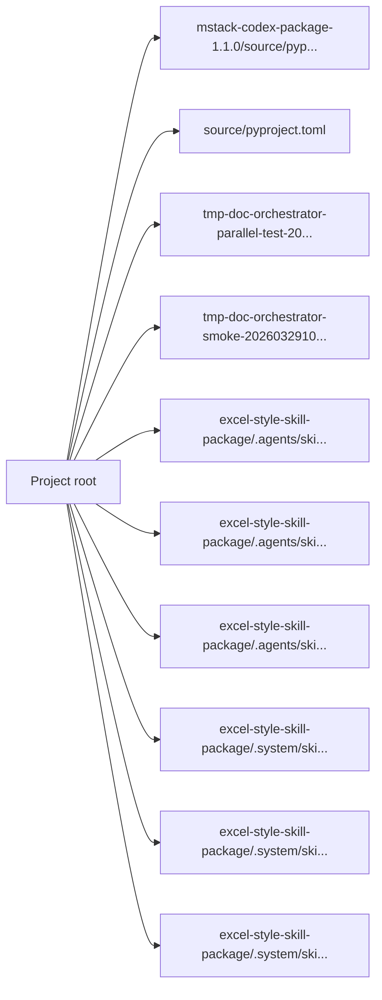

<!-- PROJECT-DOC-ORCHESTRATOR:MANAGED -->
<!-- PROJECT-DOC-ORCHESTRATOR:MANAGED-START -->
# Observed Architecture For mstack

## Architecture Rule
This architecture view is derived from inspected manifests, scripts, source layout, and docs. If there is not enough evidence, the gaps are stated plainly.

## Architecture Diagram

## Observed Architecture Notes
- The project exposes 4 inspected manifest/config file(s) that define its tooling surface.
- The project exposes 19 inspected runnable script file(s) in root/script locations.
- There are 27 inspected documentation file(s) that may describe or duplicate current behavior.

## Manifest Surface
- `mstack-codex-package-1.1.0/source/pyproject.toml`: Python project manifest with 1 script entrypoint(s)
- `source/pyproject.toml`: Python project manifest with 1 script entrypoint(s)
- `tmp-doc-orchestrator-parallel-test-20260330/package.json`: npm package with 2 script(s)
- `tmp-doc-orchestrator-smoke-20260329100642/package.json`: npm package with 2 script(s)

## Automation Surface
- `excel-style-skill-package/.agents/skills/.system/skill-creator/scripts/generate_openai_yaml.py`: """; OpenAI YAML Generator - Creates agents/openai.yaml for a skill folder.
- `excel-style-skill-package/.agents/skills/.system/skill-creator/scripts/init_skill.py`: """; Skill Initializer - Creates a new skill from template
- `excel-style-skill-package/.agents/skills/.system/skill-creator/scripts/quick_validate.py`: """; Quick validation script for skills - minimal version
- `excel-style-skill-package/.system/skill-creator/scripts/generate_openai_yaml.py`: """; OpenAI YAML Generator - Creates agents/openai.yaml for a skill folder.
- `excel-style-skill-package/.system/skill-creator/scripts/init_skill.py`: """; Skill Initializer - Creates a new skill from template
- `excel-style-skill-package/.system/skill-creator/scripts/quick_validate.py`: """; Quick validation script for skills - minimal version
- `excel_vba/excel-vba/scripts/build-reopen-smoketest.ps1`: [CmdletBinding()]; param(
- `mstack-codex-package-1.1.0/source/scripts/codex_runtime_smoke.py`: """Runtime smoke test for Codex skills.; This script temporarily installs selected skills from ``skills-codex`` into the
- `pdo-skill/scripts/doc_orchestrator_lib.py`: """Shared helpers for the project-doc-orchestrator skill."""; from __future__ import annotations
- `pdo-skill/scripts/patch_docs.py`: """Refresh the managed documentation bundle for a project."""; from __future__ import annotations

## Evidence Files
- `excel-style-skill-package/.agents/skills/.system/skill-creator/scripts/generate_openai_yaml.py`
- `excel-style-skill-package/.agents/skills/.system/skill-creator/scripts/init_skill.py`
- `excel-style-skill-package/.agents/skills/.system/skill-creator/scripts/quick_validate.py`
- `excel-style-skill-package/.system/skill-creator/scripts/generate_openai_yaml.py`
- `excel-style-skill-package/.system/skill-creator/scripts/init_skill.py`
- `excel-style-skill-package/.system/skill-creator/scripts/quick_validate.py`
- `excel_vba/README.md`
- `excel_vba/excel-vba/scripts/build-reopen-smoketest.ps1`
- `mstack-codex-package-1.1.0/source/README.md`
- `mstack-codex-package-1.1.0/source/pyproject.toml`
- `mstack-codex-package-1.1.0/source/scripts/codex_runtime_smoke.py`
- `mstack-codex-package-1.1.0/source/tests/debug/README.md`

## Refresh Metadata
- Generated at: `2026-03-30T04:38:56+00:00`
<!-- PROJECT-DOC-ORCHESTRATOR:MANAGED-END -->

<!-- PROJECT-DOC-ORCHESTRATOR:PRESERVE-START -->
Add notes here if you need human-authored content preserved across refreshes.
Do not remove the preserve markers.
<!-- PROJECT-DOC-ORCHESTRATOR:PRESERVE-END -->
