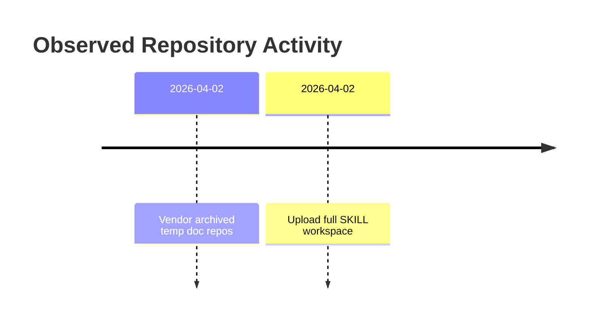

<!-- PROJECT-DOC-ORCHESTRATOR:MANAGED -->
<!-- PROJECT-DOC-ORCHESTRATOR:MANAGED-START -->
# Observed Changelog For Skill Workspace

## Changelog Rule
This file records observable project history from git metadata and documentation refresh events. It does not manufacture release notes.

## Activity Diagram

## Recent Commits
- `2026-04-02` `ffb8f7c` Vendor archived temp doc repos
- `2026-04-02` `7a2724a` Upload full SKILL workspace

## Current Working Tree Signals
- ` M docs/project-docs/ARCHITECTURE.md`
- ` M docs/project-docs/CHANGELOG.md`
- ` M docs/project-docs/GUIDE.md`
- ` M docs/project-docs/LAYOUT.md`
- ` M docs/project-docs/PLAN.md`
- ` M docs/project-docs/README.md`
- ` M docs/project-docs/project_snapshot.json`
- ` M excel_vba/README.md`
- ` M excel_vba/VALIDATION.md`
- ` M excel_vba/excel-vba/SKILL.md`
- ` M excel_vba/excel-vba/agents/openai.yaml`
- ` D "excel_vba/excel-vba/references/excel_vba_handoff_\354\232\264\354\230\201\354\262\264\355\201\254\353\246\254\354\212\244\355\212\270_20260401.md"`

## Documentation Refresh
- `2026-04-03` Managed docs refreshed from current repository inspection.

## Evidence Files
- `README.md`
- `codex-multi-agent-pack/codex-multi-agent-pack/.agents/skills/scenario-scorer/scripts/score_options.py`
- `codex-ofco-skill-pack/codex-ofco-skill-pack/.codex/skills/cost-center-mapper/scripts/run.py`
- `codex-ofco-skill-pack/codex-ofco-skill-pack/.codex/skills/flow-code-validator/scripts/run.py`
- `codex-ofco-skill-pack/codex-ofco-skill-pack/.codex/skills/invoice-match-verify/scripts/run.py`
- `codex-ofco-skill-pack/codex-ofco-skill-pack/.codex/skills/ofco-lines-export/scripts/run.py`
- `codex-ofco-skill-pack/codex-ofco-skill-pack/.codex/skills/vendor-invoice-grouping/scripts/run.py`
- `codex-ofco-skill-pack/codex-ofco-skill-pack/README.md`
- `codex-openspace-merge-pack/README.md`
- `codex-openspace-merge-pack/automation/requirements.txt`
- `codex-skill-update-pack/.agents/skills/skill-update/scripts/build_update_plan.py`
- `codex-skill-update-pack/.agents/skills/skill-update/scripts/scan_skill_graph.py`
<!-- PROJECT-DOC-ORCHESTRATOR:MANAGED-END -->

<!-- PROJECT-DOC-ORCHESTRATOR:PRESERVE-START -->
Add notes here if you need human-authored content preserved across refreshes.
Do not remove the preserve markers.
<!-- PROJECT-DOC-ORCHESTRATOR:PRESERVE-END -->
