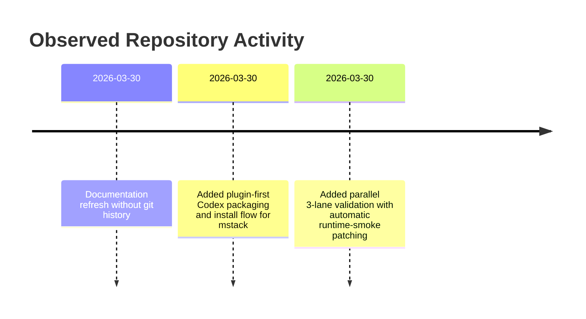

<!-- PROJECT-DOC-ORCHESTRATOR:MANAGED -->
<!-- PROJECT-DOC-ORCHESTRATOR:MANAGED-START -->
# Observed Changelog For mstack

## Changelog Rule
This file records observable project history from git metadata and documentation refresh events. It does not manufacture release notes.

## Activity Diagram

## Recent Commits
- No git commit history was available.

## Current Working Tree Signals
- No changed files were reported by git status.

## Documentation Refresh
- `2026-03-30` Managed docs refreshed from current repository inspection.

## Validation Signals
- `mstack-codex-package-1.1.0/source/scripts/run_codex_skill_validation.py` now runs three parallel validation lanes in isolated virtual environments.
- The validation lanes cover direct skill install, plugin install, and Codex runtime smoke.
- The latest successful validation report was written to `mstack-codex-package-1.1.0/source/skills-workspace/validation-reports/20260330T054531Z/`.
- Runtime smoke was patched during validation to add trusted-directory bypass support and directory-safe artifact persistence.

## Evidence Files
- `excel-style-skill-package/.agents/skills/.system/skill-creator/scripts/generate_openai_yaml.py`
- `excel-style-skill-package/.agents/skills/.system/skill-creator/scripts/init_skill.py`
- `excel-style-skill-package/.agents/skills/.system/skill-creator/scripts/quick_validate.py`
- `excel-style-skill-package/.system/skill-creator/scripts/generate_openai_yaml.py`
- `excel-style-skill-package/.system/skill-creator/scripts/init_skill.py`
- `excel-style-skill-package/.system/skill-creator/scripts/quick_validate.py`
- `excel_vba/README.md`
- `excel_vba/excel-vba/scripts/build-reopen-smoketest.ps1`
- `mstack-codex-package-1.1.0/source/README.md`
- `mstack-codex-package-1.1.0/source/pyproject.toml`
- `mstack-codex-package-1.1.0/source/scripts/codex_runtime_smoke.py`
- `mstack-codex-package-1.1.0/source/scripts/run_codex_skill_validation.py`
- `mstack-codex-package-1.1.0/source/skills-workspace/validation-reports/20260330T054531Z/validation-summary.md`
- `mstack-codex-package-1.1.0/source/tests/debug/README.md`
<!-- PROJECT-DOC-ORCHESTRATOR:MANAGED-END -->

<!-- PROJECT-DOC-ORCHESTRATOR:PRESERVE-START -->
Add notes here if you need human-authored content preserved across refreshes.
Do not remove the preserve markers.
<!-- PROJECT-DOC-ORCHESTRATOR:PRESERVE-END -->
