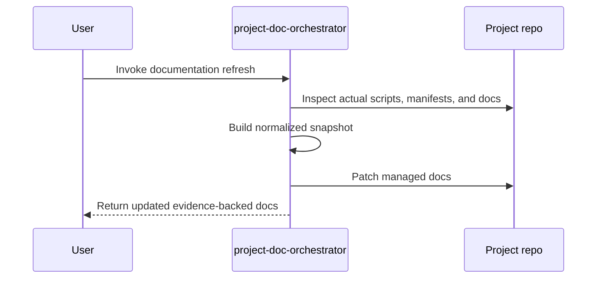

<!-- PROJECT-DOC-ORCHESTRATOR:MANAGED -->
<!-- PROJECT-DOC-ORCHESTRATOR:MANAGED-START -->
# Working Guide For Skill Workspace

## Guide Rule
Only commands and workflows verified from inspected manifests, scripts, and docs are included below.

## Guide Diagram

## Commands You Can Run
- `python -m mstack`
- `python -m pip install -r requirements.txt`
- `powershell -ExecutionPolicy Bypass -File C:/Users/SAMSUNG/Downloads/skill/excel-style-skill-package/excel-professional-formatting/scripts/run_excel_professional_formatting_validation.ps1`
- `powershell -ExecutionPolicy Bypass -File C:/Users/SAMSUNG/Downloads/skill/excel_vba/excel-vba/scripts/build-reopen-smoketest.ps1`
- `powershell -ExecutionPolicy Bypass -File C:/Users/SAMSUNG/Downloads/skill/excel_vba/plugins/excel-vba/skills/excel-vba/scripts/build-reopen-smoketest.ps1`
- `powershell -ExecutionPolicy Bypass -File C:/Users/SAMSUNG/Downloads/skill/excel_vba/scripts/run_excel_vba_validation.ps1`
- `python C:/Users/SAMSUNG/Downloads/skill/codex-multi-agent-pack/codex-multi-agent-pack/.agents/skills/scenario-scorer/scripts/score_options.py`
- `python C:/Users/SAMSUNG/Downloads/skill/codex-ofco-skill-pack/codex-ofco-skill-pack/.codex/skills/cost-center-mapper/scripts/run.py`
- `python C:/Users/SAMSUNG/Downloads/skill/codex-ofco-skill-pack/codex-ofco-skill-pack/.codex/skills/flow-code-validator/scripts/run.py`
- `python C:/Users/SAMSUNG/Downloads/skill/codex-ofco-skill-pack/codex-ofco-skill-pack/.codex/skills/invoice-match-verify/scripts/run.py`
- `python C:/Users/SAMSUNG/Downloads/skill/codex-ofco-skill-pack/codex-ofco-skill-pack/.codex/skills/ofco-lines-export/scripts/run.py`
- `python C:/Users/SAMSUNG/Downloads/skill/codex-ofco-skill-pack/codex-ofco-skill-pack/.codex/skills/vendor-invoice-grouping/scripts/run.py`

## Script Entry Points
- `codex-multi-agent-pack/codex-multi-agent-pack/.agents/skills/scenario-scorer/scripts/score_options.py`: """Deterministic weighted scenario scorer.; Usage:
- `codex-ofco-skill-pack/codex-ofco-skill-pack/.codex/skills/cost-center-mapper/scripts/run.py`: import json; import re
- `codex-ofco-skill-pack/codex-ofco-skill-pack/.codex/skills/flow-code-validator/scripts/run.py`: import json; import sys
- `codex-ofco-skill-pack/codex-ofco-skill-pack/.codex/skills/invoice-match-verify/scripts/run.py`: import json; import math
- `codex-ofco-skill-pack/codex-ofco-skill-pack/.codex/skills/ofco-lines-export/scripts/run.py`: import csv; import json
- `codex-ofco-skill-pack/codex-ofco-skill-pack/.codex/skills/vendor-invoice-grouping/scripts/run.py`: import json; import sys
- `codex-skill-update-pack/.agents/skills/skill-update/scripts/build_update_plan.py`: from __future__ import annotations; import argparse
- `codex-skill-update-pack/.agents/skills/skill-update/scripts/scan_skill_graph.py`: from __future__ import annotations; import argparse
- `codex-skill-update-pack/.agents/skills/skill-update/scripts/validate_outputs.py`: from __future__ import annotations; import argparse
- `design-upgrade-loop-package/design-upgrade-loop-package/.agents/skills/design-upgrade-loop/scripts/validate_design_scorecard.py`: """Validate a design-upgrade scorecard and print a PASS/FAIL summary.; Usage:

## Documentation Inputs
- `README.md`: Skill Workspace
- `codex/word-style-package-20260403/README.md`: word-style-package-20260403
- `codex-ofco-skill-pack/codex-ofco-skill-pack/README.md`: Codex OFCO Skill Pack
- `codex-openspace-merge-pack/README.md`: Codex + OpenSpace Merge Pack
- `codex-skill-update-pack/README.md`: codex-skill-update-pack
- `codex_excel_risk_pack/codex_excel_risk_pack/README-CODEX-EXCEL-RISK-PACK.md`: Codex Excel High-Risk Pack
- `codex_excel_risk_pack/codex_excel_risk_pack/docs/ops/benchmark-notes-2026.md`: Benchmark Notes (2026)
- `codex_excel_risk_pack/codex_excel_risk_pack/docs/ops/excel-runtime-runbook.md`: Excel Runtime Runbook
- `codex_excel_risk_pack/codex_excel_risk_pack/docs/ops/prompt-examples.md`: Prompt Examples
- `codex_excel_risk_pack/codex_excel_risk_pack/docs/ops/validation-checklist.md`: Validation Checklist

## Evidence Files
- `README.md`
- `codex-multi-agent-pack/codex-multi-agent-pack/.agents/skills/scenario-scorer/scripts/score_options.py`
- `codex-ofco-skill-pack/codex-ofco-skill-pack/.codex/skills/cost-center-mapper/scripts/run.py`
- `codex-ofco-skill-pack/codex-ofco-skill-pack/.codex/skills/flow-code-validator/scripts/run.py`
- `codex-ofco-skill-pack/codex-ofco-skill-pack/.codex/skills/invoice-match-verify/scripts/run.py`
- `codex-ofco-skill-pack/codex-ofco-skill-pack/.codex/skills/ofco-lines-export/scripts/run.py`
- `codex-ofco-skill-pack/codex-ofco-skill-pack/.codex/skills/vendor-invoice-grouping/scripts/run.py`
- `codex-ofco-skill-pack/codex-ofco-skill-pack/README.md`
- `codex-openspace-merge-pack/README.md`
- `codex-openspace-merge-pack/automation/requirements.txt`
- `codex-skill-update-pack/.agents/skills/skill-update/scripts/build_update_plan.py`
- `codex-skill-update-pack/.agents/skills/skill-update/scripts/scan_skill_graph.py`

## Refresh Metadata
- Generated at: `2026-04-03T17:14:40+00:00`
<!-- PROJECT-DOC-ORCHESTRATOR:MANAGED-END -->

<!-- PROJECT-DOC-ORCHESTRATOR:PRESERVE-START -->
## Navigation

- Workspace root entrypoint: [README.md](../../README.md)
- Shared workspace notes: [docs/workspace-notes/README.md](../workspace-notes/README.md)

Add notes here if you need human-authored content preserved across refreshes.
Do not remove the preserve markers.
<!-- PROJECT-DOC-ORCHESTRATOR:PRESERVE-END -->
