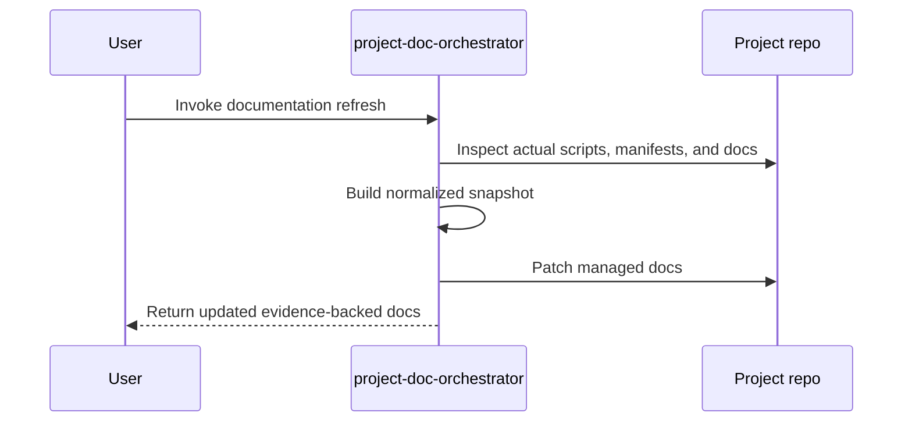

<!-- PROJECT-DOC-ORCHESTRATOR:MANAGED -->
<!-- PROJECT-DOC-ORCHESTRATOR:MANAGED-START -->
# Working Guide For mstack

## Guide Rule
Only commands and workflows verified from inspected manifests, scripts, and docs are included below.

## Guide Diagram

## Commands You Can Run
- `npm run docs`
- `npm run start`
- `python -m mstack`
- `python C:/Users/SAMSUNG/Downloads/skill/mstack-codex-package-1.1.0/source/scripts/run_codex_skill_validation.py`
- `python C:/Users/SAMSUNG/Downloads/skill/mstack-codex-package-1.1.0/source/scripts/codex_runtime_smoke.py --repo C:/Users/SAMSUNG/Downloads/skill/mstack-codex-package-1.1.0/source --keep-artifacts --skip-git-repo-check --timeout 240`
- `powershell -ExecutionPolicy Bypass -File C:/Users/SAMSUNG/Downloads/skill/excel_vba/excel-vba/scripts/build-reopen-smoketest.ps1`
- `powershell -ExecutionPolicy Bypass -File C:/Users/SAMSUNG/Downloads/skill/tmp-doc-orchestrator-parallel-test-20260330/scripts/build.ps1`
- `powershell -ExecutionPolicy Bypass -File C:/Users/SAMSUNG/Downloads/skill/tmp-doc-orchestrator-smoke-20260329100642/scripts/build.ps1`
- `python C:/Users/SAMSUNG/Downloads/skill/excel-style-skill-package/.agents/skills/.system/skill-creator/scripts/generate_openai_yaml.py`
- `python C:/Users/SAMSUNG/Downloads/skill/excel-style-skill-package/.agents/skills/.system/skill-creator/scripts/init_skill.py`
- `python C:/Users/SAMSUNG/Downloads/skill/excel-style-skill-package/.agents/skills/.system/skill-creator/scripts/quick_validate.py`
- `python C:/Users/SAMSUNG/Downloads/skill/excel-style-skill-package/.system/skill-creator/scripts/generate_openai_yaml.py`
- `python C:/Users/SAMSUNG/Downloads/skill/excel-style-skill-package/.system/skill-creator/scripts/init_skill.py`
- `python C:/Users/SAMSUNG/Downloads/skill/excel-style-skill-package/.system/skill-creator/scripts/quick_validate.py`

## Script Entry Points
- `excel-style-skill-package/.agents/skills/.system/skill-creator/scripts/generate_openai_yaml.py`: """; OpenAI YAML Generator - Creates agents/openai.yaml for a skill folder.
- `excel-style-skill-package/.agents/skills/.system/skill-creator/scripts/init_skill.py`: """; Skill Initializer - Creates a new skill from template
- `excel-style-skill-package/.agents/skills/.system/skill-creator/scripts/quick_validate.py`: """; Quick validation script for skills - minimal version
- `excel-style-skill-package/.system/skill-creator/scripts/generate_openai_yaml.py`: """; OpenAI YAML Generator - Creates agents/openai.yaml for a skill folder.
- `excel-style-skill-package/.system/skill-creator/scripts/init_skill.py`: """; Skill Initializer - Creates a new skill from template
- `excel-style-skill-package/.system/skill-creator/scripts/quick_validate.py`: """; Quick validation script for skills - minimal version
- `excel_vba/excel-vba/scripts/build-reopen-smoketest.ps1`: [CmdletBinding()]; param(
- `mstack-codex-package-1.1.0/source/scripts/codex_runtime_smoke.py`: """Runtime smoke test for Codex skills.; This script temporarily installs selected skills from ``skills-codex`` into the
- `mstack-codex-package-1.1.0/source/scripts/run_codex_skill_validation.py`: """Parallel end-to-end validation runner for MStack Codex skills and plugin packaging.
- `pdo-skill/scripts/doc_orchestrator_lib.py`: """Shared helpers for the project-doc-orchestrator skill."""; from __future__ import annotations
- `pdo-skill/scripts/patch_docs.py`: """Refresh the managed documentation bundle for a project."""; from __future__ import annotations

## Validation Workflow
- Run `mstack-codex-package-1.1.0/source/scripts/run_codex_skill_validation.py` to execute the full plugin-first validation flow.
- The runner builds the wheel once, creates isolated virtual environments, and executes three lanes in parallel.
- The lanes validate direct skill install, plugin install with marketplace generation, and Codex runtime smoke for all 9 `mstack-*` skills.
- JSON and Markdown reports are written under `mstack-codex-package-1.1.0/source/skills-workspace/validation-reports/<timestamp>/`.
- The latest successful report directory observed during inspection is `mstack-codex-package-1.1.0/source/skills-workspace/validation-reports/20260330T054531Z/`.

## Documentation Inputs
- `excel_vba/README.md`: excel-vba Skill Repo
- `mstack-codex-package-1.1.0/source/README.md`: ccat — Claude Code Agent Teams CLI
- `mstack-codex-package-1.1.0/source/tests/debug/README.md`: tests/debug/
- `source/README.md`: ccat — Claude Code Agent Teams CLI
- `source/docs/ARCHITECTURE.md`: System Architecture — mstack (ccat)
- `source/docs/CHANGELOG.md`: Changelog — mstack (ccat)
- `source/docs/getting-started.md`: mstack 시작하기 (Getting Started)
- `source/docs/LAYOUT.md`: Project Layout — mstack (ccat)
- `source/docs/README.md`: mstack (ccat) — Claude Code Agent Teams CLI
- `source/docs/user-guide.md`: mstack 사용자 가이드 (v1.4)

## Evidence Files
- `excel-style-skill-package/.agents/skills/.system/skill-creator/scripts/generate_openai_yaml.py`
- `excel-style-skill-package/.agents/skills/.system/skill-creator/scripts/init_skill.py`
- `excel-style-skill-package/.agents/skills/.system/skill-creator/scripts/quick_validate.py`
- `excel-style-skill-package/.system/skill-creator/scripts/generate_openai_yaml.py`
- `excel-style-skill-package/.system/skill-creator/scripts/init_skill.py`
- `excel-style-skill-package/.system/skill-creator/scripts/quick_validate.py`
- `excel_vba/README.md`
- `excel_vba/excel-vba/scripts/build-reopen-smoketest.ps1`
- `mstack-codex-package-1.1.0/source/README.md`
- `mstack-codex-package-1.1.0/source/pyproject.toml`
- `mstack-codex-package-1.1.0/source/scripts/codex_runtime_smoke.py`
- `mstack-codex-package-1.1.0/source/scripts/run_codex_skill_validation.py`
- `mstack-codex-package-1.1.0/source/skills-workspace/validation-reports/20260330T054531Z/validation-summary.md`
- `mstack-codex-package-1.1.0/source/tests/debug/README.md`

## Refresh Metadata
- Generated at: `2026-03-30T05:45:31+00:00`
<!-- PROJECT-DOC-ORCHESTRATOR:MANAGED-END -->

<!-- PROJECT-DOC-ORCHESTRATOR:PRESERVE-START -->
## Navigation

- Workspace root entrypoint: [README.md](../../README.md)
- Shared workspace notes: [docs/workspace-notes/README.md](../workspace-notes/README.md)

Add notes here if you need human-authored content preserved across refreshes.
Do not remove the preserve markers.
<!-- PROJECT-DOC-ORCHESTRATOR:PRESERVE-END -->
