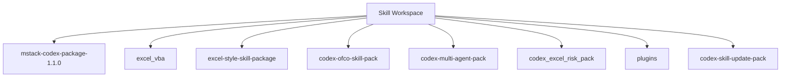

<!-- PROJECT-DOC-ORCHESTRATOR:MANAGED -->
<!-- PROJECT-DOC-ORCHESTRATOR:MANAGED-START -->
# Repository Layout For Skill Workspace

## Layout Rule
This layout reflects the current filesystem inspection, not an assumed project template.

## Layout Diagram


## Tree Snapshot
```text
skill/
|-- .agents/
|   \-- plugins/
|       \-- marketplace.json
|-- codex/
|   |-- word-style-package-20260403/
|   |   |-- .agents/
|   |   \-- README.md
|   \-- word-style-package-20260403.zip
|-- codex-multi-agent-pack/
|   \-- codex-multi-agent-pack/
|       |-- .agents/
|       \-- AGENTS.md
|-- codex-ofco-skill-pack/
|   \-- codex-ofco-skill-pack/
|       |-- .codex/
|       |-- AGENTS.md
|       \-- README.md
|-- codex-openspace-merge-pack/
|   |-- .agents/
|   |   \-- skills/
|   |-- .codex/
|   |   \-- config.toml.example
|   |-- automation/
|   |   |-- templates/
|   |   |-- one_click_app.py
|   |   |-- requirements.txt
|   |   |-- run_full_workflow.py
|   |   \-- setup_merge.sh
|   |-- AGENTS.merge-snippet.md
|   \-- README.md
|-- codex-skill-update-pack/
|   |-- .agents/
|   |   \-- skills/
|   |-- .codex/
|   |   \-- agents/
|   \-- README.md
|-- codex_excel_risk_pack/
|   \-- codex_excel_risk_pack/
|       |-- .agents/
|       |-- .codex/
|       |-- docs/
|       |-- AGENTS.md
|       |-- heartbeat.md
|       \-- README-CODEX-EXCEL-RISK-PACK.md
|-- design-upgrade-loop-package/
|   \-- design-upgrade-loop-package/
|       |-- .agents/
|       \-- AGENTS.md
|-- docs/
|   \-- workspace-notes/
|       |-- 20260330_HVDC_TR_통합_운영_가이드_v3.5_AGI_KR (1).docx
|       |-- agitr.md
|       |-- agitr_change_report.md
|       |-- Codex 스킬·플러그인·멀티 에이전트 제작 가이드와 참고 리포트.docx
|       |-- codex_skill_plugin_mutiagent_guidebook.md
|       \-- README.md
|-- excel-style-skill-package/
|   |-- .agents/
|   |   \-- skills/
|   |-- .system/
|   |   \-- skill-creator/
|   |-- excel-professional-formatting/
|   |   |-- .agents/
|   |   |-- agents/
|   |   |-- plugins/
|   |   |-- references/
|   |   |-- scripts/
|   |   |-- .gitignore
|   |   |-- install_excel_professional_formatting_plugin.ps1
|   |   |-- install_excel_professional_formatting_skill.ps1
|   |   |-- README.md
|   |   |-- SKILL.md
|   |   \-- VALIDATION.md
|   |-- excel-vba/
|   |   |-- agents/
|   |   |-- references/
|   |   |-- install_excel_vba_skill.ps1
|   |   \-- SKILL.md.disabled
|   |-- spreadsheet/
|   |   |-- agents/
```

## Top-Level Entry Counts
- `mstack-codex-package-1.1.0`: 288 item(s)
- `excel_vba`: 85 item(s)
- `excel-style-skill-package`: 75 item(s)
- `codex-ofco-skill-pack`: 23 item(s)
- `codex-multi-agent-pack`: 19 item(s)
- `codex_excel_risk_pack`: 15 item(s)
- `plugins`: 11 item(s)
- `codex-skill-update-pack`: 10 item(s)
- `pdo-skill`: 10 item(s)
- `codex-openspace-merge-pack`: 9 item(s)

## Files Used To Infer Layout
- `README.md`
- `codex-multi-agent-pack/codex-multi-agent-pack/.agents/skills/scenario-scorer/scripts/score_options.py`
- `codex-ofco-skill-pack/codex-ofco-skill-pack/.codex/skills/cost-center-mapper/scripts/run.py`
- `codex-ofco-skill-pack/codex-ofco-skill-pack/.codex/skills/flow-code-validator/scripts/run.py`
- `codex-ofco-skill-pack/codex-ofco-skill-pack/.codex/skills/invoice-match-verify/scripts/run.py`
- `codex-ofco-skill-pack/codex-ofco-skill-pack/.codex/skills/ofco-lines-export/scripts/run.py`
- `codex-ofco-skill-pack/codex-ofco-skill-pack/.codex/skills/vendor-invoice-grouping/scripts/run.py`
- `codex-ofco-skill-pack/codex-ofco-skill-pack/README.md`
- `codex-openspace-merge-pack/README.md`
- `codex-openspace-merge-pack/automation/requirements.txt`
- `codex-skill-update-pack/.agents/skills/skill-update/scripts/build_update_plan.py`
- `codex-skill-update-pack/.agents/skills/skill-update/scripts/scan_skill_graph.py`

## Refresh Metadata
- Generated at: `2026-04-03T17:14:40+00:00`
<!-- PROJECT-DOC-ORCHESTRATOR:MANAGED-END -->

<!-- PROJECT-DOC-ORCHESTRATOR:PRESERVE-START -->
Add notes here if you need human-authored content preserved across refreshes.
Do not remove the preserve markers.
<!-- PROJECT-DOC-ORCHESTRATOR:PRESERVE-END -->
