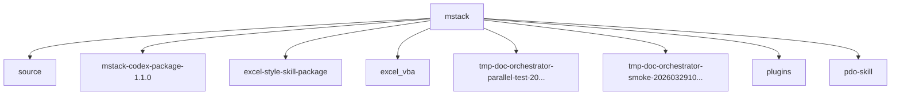

<!-- PROJECT-DOC-ORCHESTRATOR:MANAGED -->
<!-- PROJECT-DOC-ORCHESTRATOR:MANAGED-START -->
# Repository Layout For mstack

## Layout Rule
This layout reflects the current filesystem inspection, not an assumed project template.

## Layout Diagram


## Tree Snapshot
```text
skill/
|-- .agents/
|   \-- plugins/
|       \-- marketplace.json
|-- excel-style-skill-package/
|   |-- .agents/
|   |   \-- skills/
|   |-- .system/
|   |   \-- skill-creator/
|   |-- excel-professional-formatting/
|   |   |-- agents/
|   |   |-- references/
|   |   |-- install_excel_professional_formatting_skill.ps1
|   |   \-- SKILL.md.disabled
|   |-- excel-vba/
|   |   |-- agents/
|   |   |-- references/
|   |   |-- install_excel_vba_skill.ps1
|   |   \-- SKILL.md.disabled
|   |-- spreadsheet/
|   |   |-- agents/
|   |   |-- assets/
|   |   |-- references/
|   |   |-- LICENSE.txt
|   |   \-- SKILL.md.disabled
|   \-- install_excel_style_skills.ps1
|-- excel_vba/
|   |-- excel-vba/
|   |   |-- agents/
|   |   |-- references/
|   |   |-- scripts/
|   |   \-- SKILL.md.disabled
|   |-- .gitignore
|   |-- install_excel_vba_skill.ps1
|   \-- README.md
|-- mstack-codex-package-1.1.0/
|   |-- source/
|   |   |-- core/
|   |   |-- presets/
|   |   |-- scripts/
|   |   |-- skills/
|   |   |-- skills-codex/
|   |   |-- tests/
|   |   |-- .gitignore
|   |   |-- AGENTS.md
|   |   |-- cost.py
|   |   |-- INSTALL_CODEX.md
|   |   |-- mstack.py
|   |   |-- pyproject.toml
|   |   \-- README.md
|   |-- wheel/
|   |   \-- mstack-1.1.0-py3-none-any.whl
|   \-- PACKAGE_CONTENTS.txt
|-- pdo-skill/
|   |-- agents/
|   |   \-- openai.yaml
|   |-- references/
|   |   |-- evidence-rule.md
|   |   |-- file-contract.md
|   |   |-- mermaid-guidelines.md
|   |   \-- workflow.md
|   |-- scripts/
|   |   |-- doc_orchestrator_lib.py
|   |   |-- patch_docs.py
|   |   |-- project_snapshot.py
|   |   \-- scaffold_docs.py
|   \-- SKILL.md
|-- plugins/
|   \-- project-doc-orchestrator/
|       |-- .codex-plugin/
|       \-- skills/
|-- source/
|   |-- core/
|   |   |-- _assets/
|   |   |-- __init__.py
|   |   |-- assets.py
|   |   |-- claude_md.py
|   |   |-- config.py
|   |   |-- cost.py
|   |   |-- dashboard.py
|   |   |-- doctor.py
```

## Top-Level Entry Counts
- `source`: 134 item(s)
- `mstack-codex-package-1.1.0`: 128 item(s)
- `excel-style-skill-package`: 53 item(s)
- `excel_vba`: 18 item(s)
- `tmp-doc-orchestrator-parallel-test-20260330`: 13 item(s)
- `tmp-doc-orchestrator-smoke-20260329100642`: 12 item(s)
- `plugins`: 11 item(s)
- `pdo-skill`: 10 item(s)
- `Codex 스킬·플러그인·멀티 에이전트 제작 가이드와 참고 리포트.docx`: 1 item(s)
- `codex_skill_plugin_mutiagent_guidebook.md`: 1 item(s)

## Files Used To Infer Layout
- `excel-style-skill-package/.agents/skills/.system/skill-creator/scripts/generate_openai_yaml.py`
- `excel-style-skill-package/.agents/skills/.system/skill-creator/scripts/init_skill.py`
- `excel-style-skill-package/.agents/skills/.system/skill-creator/scripts/quick_validate.py`
- `excel-style-skill-package/.system/skill-creator/scripts/generate_openai_yaml.py`
- `excel-style-skill-package/.system/skill-creator/scripts/init_skill.py`
- `excel-style-skill-package/.system/skill-creator/scripts/quick_validate.py`
- `excel_vba/README.md`
- `excel_vba/excel-vba/scripts/build-reopen-smoketest.ps1`
- `mstack-codex-package-1.1.0/source/README.md`
- `mstack-codex-package-1.1.0/source/pyproject.toml`
- `mstack-codex-package-1.1.0/source/scripts/codex_runtime_smoke.py`
- `mstack-codex-package-1.1.0/source/tests/debug/README.md`

## Refresh Metadata
- Generated at: `2026-03-30T04:38:56+00:00`
<!-- PROJECT-DOC-ORCHESTRATOR:MANAGED-END -->

<!-- PROJECT-DOC-ORCHESTRATOR:PRESERVE-START -->
Add notes here if you need human-authored content preserved across refreshes.
Do not remove the preserve markers.
<!-- PROJECT-DOC-ORCHESTRATOR:PRESERVE-END -->
