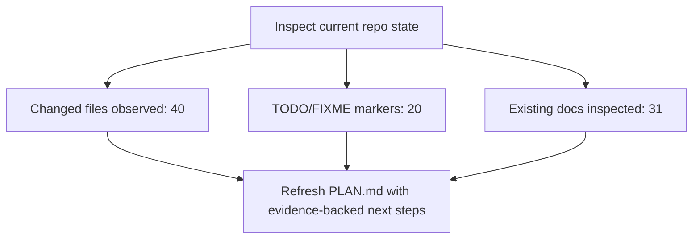

<!-- PROJECT-DOC-ORCHESTRATOR:MANAGED -->
<!-- PROJECT-DOC-ORCHESTRATOR:MANAGED-START -->
# Current Plan For Skill Workspace

## Planning Rule
This plan only uses observed repository state, TODO markers, git activity, and inspected scripts/docs. It does not invent backlog items.

## Plan Diagram

## Evidence-Backed Next Actions
- Review and document the 40 changed file(s) already visible in git status.
- Triaging TODO/FIXME markers is evidence-backed work that can be planned immediately.
- Validate the inspected runnable scripts and keep GUIDE.md aligned with their real invocation shape.
- Keep setup and architecture documentation synchronized with the inspected manifest files.

## TODO And FIXME Evidence
- `excel-style-skill-package/.agents/skills/.system/skill-creator/scripts/init_skill.py:28` description: [TODO: Complete and informative explanation of what the skill does and when to use it. Include WHEN to use this skill - specific scenarios, file types, or tasks that t
- `excel-style-skill-package/.agents/skills/.system/skill-creator/scripts/init_skill.py:35` [TODO: 1-2 sentences explaining what this skill enables]
- `excel-style-skill-package/.agents/skills/.system/skill-creator/scripts/init_skill.py:39` [TODO: Choose the structure that best fits this skill's purpose. Common patterns:
- `excel-style-skill-package/.agents/skills/.system/skill-creator/scripts/init_skill.py:65` ## [TODO: Replace with the first main section based on chosen structure]
- `excel-style-skill-package/.agents/skills/.system/skill-creator/scripts/init_skill.py:67` [TODO: Add content here. See examples in existing skills:
- `excel-style-skill-package/.agents/skills/.system/skill-creator/scripts/init_skill.py:127` # TODO: Add actual script logic here
- `excel-style-skill-package/.agents/skills/.system/skill-creator/scripts/init_skill.py:319` print("1. Edit SKILL.md to complete the TODO items and update the description")
- `excel-style-skill-package/.system/skill-creator/scripts/init_skill.py:28` description: [TODO: Complete and informative explanation of what the skill does and when to use it. Include WHEN to use this skill - specific scenarios, file types, or tasks that t
- `excel-style-skill-package/.system/skill-creator/scripts/init_skill.py:35` [TODO: 1-2 sentences explaining what this skill enables]
- `excel-style-skill-package/.system/skill-creator/scripts/init_skill.py:39` [TODO: Choose the structure that best fits this skill's purpose. Common patterns:
- `excel-style-skill-package/.system/skill-creator/scripts/init_skill.py:65` ## [TODO: Replace with the first main section based on chosen structure]
- `excel-style-skill-package/.system/skill-creator/scripts/init_skill.py:67` [TODO: Add content here. See examples in existing skills:

## Recent Activity Considered
- `2026-04-02` `ffb8f7c` Vendor archived temp doc repos
- `2026-04-02` `7a2724a` Upload full SKILL workspace

## Evidence Files
- `README.md`
- `codex-multi-agent-pack/codex-multi-agent-pack/.agents/skills/scenario-scorer/scripts/score_options.py`
- `codex-ofco-skill-pack/codex-ofco-skill-pack/.codex/skills/cost-center-mapper/scripts/run.py`
- `codex-ofco-skill-pack/codex-ofco-skill-pack/.codex/skills/flow-code-validator/scripts/run.py`
- `codex-ofco-skill-pack/codex-ofco-skill-pack/.codex/skills/invoice-match-verify/scripts/run.py`
- `codex-ofco-skill-pack/codex-ofco-skill-pack/.codex/skills/ofco-lines-export/scripts/run.py`
- `codex-ofco-skill-pack/codex-ofco-skill-pack/.codex/skills/vendor-invoice-grouping/scripts/run.py`
- `codex-ofco-skill-pack/codex-ofco-skill-pack/README.md`
- `codex-openspace-merge-pack/README.md`
- `codex-openspace-merge-pack/automation/requirements.txt`
- `codex-skill-update-pack/.agents/skills/skill-update/scripts/build_update_plan.py`
- `codex-skill-update-pack/.agents/skills/skill-update/scripts/scan_skill_graph.py`

## Refresh Metadata
- Generated at: `2026-04-03T17:14:40+00:00`
<!-- PROJECT-DOC-ORCHESTRATOR:MANAGED-END -->

<!-- PROJECT-DOC-ORCHESTRATOR:PRESERVE-START -->
Add notes here if you need human-authored content preserved across refreshes.
Do not remove the preserve markers.
<!-- PROJECT-DOC-ORCHESTRATOR:PRESERVE-END -->
