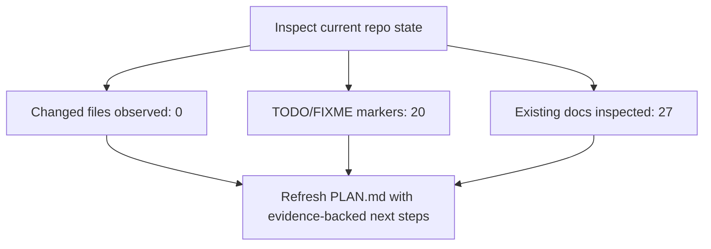

<!-- PROJECT-DOC-ORCHESTRATOR:MANAGED -->
<!-- PROJECT-DOC-ORCHESTRATOR:MANAGED-START -->
# Current Plan For mstack

## Planning Rule
This plan only uses observed repository state, TODO markers, git activity, and inspected scripts/docs. It does not invent backlog items.

## Plan Diagram

## Evidence-Backed Next Actions
- Triaging TODO/FIXME markers is evidence-backed work that can be planned immediately.
- Validate the inspected runnable scripts and keep GUIDE.md aligned with their real invocation shape.
- Keep setup and architecture documentation synchronized with the inspected manifest files.

## TODO And FIXME Evidence
- `excel-style-skill-package/.agents/skills/.system/skill-creator/scripts/init_skill.py:28` description: [TODO: Complete and informative explanation of what the skill does and when to use it. Include WHEN to use this skill - specific scenarios, file types, or tasks that t
- `excel-style-skill-package/.agents/skills/.system/skill-creator/scripts/init_skill.py:35` [TODO: 1-2 sentences explaining what this skill enables]
- `excel-style-skill-package/.agents/skills/.system/skill-creator/scripts/init_skill.py:39` [TODO: Choose the structure that best fits this skill's purpose. Common patterns:
- `excel-style-skill-package/.agents/skills/.system/skill-creator/scripts/init_skill.py:65` ## [TODO: Replace with the first main section based on chosen structure]
- `excel-style-skill-package/.agents/skills/.system/skill-creator/scripts/init_skill.py:67` [TODO: Add content here. See examples in existing skills:
- `excel-style-skill-package/.agents/skills/.system/skill-creator/scripts/init_skill.py:127` # TODO: Add actual script logic here
- `excel-style-skill-package/.agents/skills/.system/skill-creator/scripts/init_skill.py:319` print("1. Edit SKILL.md to complete the TODO items and update the description")
- `excel-style-skill-package/.system/skill-creator/scripts/init_skill.py:28` description: [TODO: Complete and informative explanation of what the skill does and when to use it. Include WHEN to use this skill - specific scenarios, file types, or tasks that t
- `excel-style-skill-package/.system/skill-creator/scripts/init_skill.py:35` [TODO: 1-2 sentences explaining what this skill enables]
- `excel-style-skill-package/.system/skill-creator/scripts/init_skill.py:39` [TODO: Choose the structure that best fits this skill's purpose. Common patterns:
- `excel-style-skill-package/.system/skill-creator/scripts/init_skill.py:65` ## [TODO: Replace with the first main section based on chosen structure]
- `excel-style-skill-package/.system/skill-creator/scripts/init_skill.py:67` [TODO: Add content here. See examples in existing skills:

## Recent Activity Considered
- No git commit history was available.

## Evidence Files
- `excel-style-skill-package/.agents/skills/.system/skill-creator/scripts/generate_openai_yaml.py`
- `excel-style-skill-package/.agents/skills/.system/skill-creator/scripts/init_skill.py`
- `excel-style-skill-package/.agents/skills/.system/skill-creator/scripts/quick_validate.py`
- `excel-style-skill-package/.system/skill-creator/scripts/generate_openai_yaml.py`
- `excel-style-skill-package/.system/skill-creator/scripts/init_skill.py`
- `excel-style-skill-package/.system/skill-creator/scripts/quick_validate.py`
- `excel_vba/README.md`
- `excel_vba/excel-vba/scripts/build-reopen-smoketest.ps1`
- `mstack-codex-package-1.1.0/source/README.md`
- `mstack-codex-package-1.1.0/source/pyproject.toml`
- `mstack-codex-package-1.1.0/source/scripts/codex_runtime_smoke.py`
- `mstack-codex-package-1.1.0/source/tests/debug/README.md`

## Refresh Metadata
- Generated at: `2026-03-30T04:38:56+00:00`
<!-- PROJECT-DOC-ORCHESTRATOR:MANAGED-END -->

<!-- PROJECT-DOC-ORCHESTRATOR:PRESERVE-START -->
Add notes here if you need human-authored content preserved across refreshes.
Do not remove the preserve markers.
<!-- PROJECT-DOC-ORCHESTRATOR:PRESERVE-END -->
