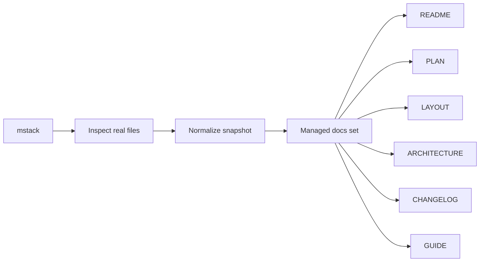

<!-- PROJECT-DOC-ORCHESTRATOR:MANAGED -->
<!-- PROJECT-DOC-ORCHESTRATOR:MANAGED-START -->
# mstack

> Managed by `project-doc-orchestrator`. This file is regenerated from inspected repository evidence.

## Purpose
High-level project summary based on inspected files.

## Evidence Rule
This document was generated only after reading real manifests, scripts, and docs from the project. Missing evidence is called out instead of guessed.

## Overview Diagram

## Observations
- Detected 4 manifest/config file(s).
- Inspected 19 runnable script file(s).
- Inspected 27 existing documentation file(s).
- Git metadata was not available.
- Found 20 TODO/FIXME-style marker(s) in inspected text files.

## Inspected Manifests
- `mstack-codex-package-1.1.0/source/pyproject.toml`: Python project manifest with 1 script entrypoint(s)
- `source/pyproject.toml`: Python project manifest with 1 script entrypoint(s)
- `tmp-doc-orchestrator-parallel-test-20260330/package.json`: npm package with 2 script(s)
- `tmp-doc-orchestrator-smoke-20260329100642/package.json`: npm package with 2 script(s)

## Inspected Scripts
- `excel-style-skill-package/.agents/skills/.system/skill-creator/scripts/generate_openai_yaml.py`: """; OpenAI YAML Generator - Creates agents/openai.yaml for a skill folder.
- `excel-style-skill-package/.agents/skills/.system/skill-creator/scripts/init_skill.py`: """; Skill Initializer - Creates a new skill from template
- `excel-style-skill-package/.agents/skills/.system/skill-creator/scripts/quick_validate.py`: """; Quick validation script for skills - minimal version
- `excel-style-skill-package/.system/skill-creator/scripts/generate_openai_yaml.py`: """; OpenAI YAML Generator - Creates agents/openai.yaml for a skill folder.
- `excel-style-skill-package/.system/skill-creator/scripts/init_skill.py`: """; Skill Initializer - Creates a new skill from template
- `excel-style-skill-package/.system/skill-creator/scripts/quick_validate.py`: """; Quick validation script for skills - minimal version
- `excel_vba/excel-vba/scripts/build-reopen-smoketest.ps1`: [CmdletBinding()]; param(
- `mstack-codex-package-1.1.0/source/scripts/codex_runtime_smoke.py`: """Runtime smoke test for Codex skills.; This script temporarily installs selected skills from ``skills-codex`` into the
- `pdo-skill/scripts/doc_orchestrator_lib.py`: """Shared helpers for the project-doc-orchestrator skill."""; from __future__ import annotations
- `pdo-skill/scripts/patch_docs.py`: """Refresh the managed documentation bundle for a project."""; from __future__ import annotations

## Existing Docs
- `excel_vba/README.md`: excel-vba Skill Repo
- `mstack-codex-package-1.1.0/source/README.md`: ccat — Claude Code Agent Teams CLI
- `mstack-codex-package-1.1.0/source/tests/debug/README.md`: tests/debug/
- `source/README.md`: ccat — Claude Code Agent Teams CLI
- `source/docs/ARCHITECTURE.md`: System Architecture — mstack (ccat)
- `source/docs/CHANGELOG.md`: Changelog — mstack (ccat)
- `source/docs/getting-started.md`: mstack 시작하기 (Getting Started)
- `source/docs/LAYOUT.md`: Project Layout — mstack (ccat)
- `source/docs/README.md`: mstack (ccat) — Claude Code Agent Teams CLI
- `source/docs/user-guide.md`: mstack 사용자 가이드 (v1.4)

## Commands Derived From Inspected Files
- `npm run docs`
- `npm run start`
- `python -m mstack`
- `powershell -ExecutionPolicy Bypass -File C:/Users/SAMSUNG/Downloads/skill/excel_vba/excel-vba/scripts/build-reopen-smoketest.ps1`
- `powershell -ExecutionPolicy Bypass -File C:/Users/SAMSUNG/Downloads/skill/tmp-doc-orchestrator-parallel-test-20260330/scripts/build.ps1`
- `powershell -ExecutionPolicy Bypass -File C:/Users/SAMSUNG/Downloads/skill/tmp-doc-orchestrator-smoke-20260329100642/scripts/build.ps1`
- `python C:/Users/SAMSUNG/Downloads/skill/excel-style-skill-package/.agents/skills/.system/skill-creator/scripts/generate_openai_yaml.py`
- `python C:/Users/SAMSUNG/Downloads/skill/excel-style-skill-package/.agents/skills/.system/skill-creator/scripts/init_skill.py`
- `python C:/Users/SAMSUNG/Downloads/skill/excel-style-skill-package/.agents/skills/.system/skill-creator/scripts/quick_validate.py`
- `python C:/Users/SAMSUNG/Downloads/skill/excel-style-skill-package/.system/skill-creator/scripts/generate_openai_yaml.py`
- `python C:/Users/SAMSUNG/Downloads/skill/excel-style-skill-package/.system/skill-creator/scripts/init_skill.py`
- `python C:/Users/SAMSUNG/Downloads/skill/excel-style-skill-package/.system/skill-creator/scripts/quick_validate.py`

## Evidence Files
- `excel-style-skill-package/.agents/skills/.system/skill-creator/scripts/generate_openai_yaml.py`
- `excel-style-skill-package/.agents/skills/.system/skill-creator/scripts/init_skill.py`
- `excel-style-skill-package/.agents/skills/.system/skill-creator/scripts/quick_validate.py`
- `excel-style-skill-package/.system/skill-creator/scripts/generate_openai_yaml.py`
- `excel-style-skill-package/.system/skill-creator/scripts/init_skill.py`
- `excel-style-skill-package/.system/skill-creator/scripts/quick_validate.py`
- `excel_vba/README.md`
- `excel_vba/excel-vba/scripts/build-reopen-smoketest.ps1`
- `mstack-codex-package-1.1.0/source/README.md`
- `mstack-codex-package-1.1.0/source/pyproject.toml`
- `mstack-codex-package-1.1.0/source/scripts/codex_runtime_smoke.py`
- `mstack-codex-package-1.1.0/source/tests/debug/README.md`

## Refresh Metadata
- Generated at: `2026-03-30T04:38:56+00:00`
- Project root: `C:\Users\SAMSUNG\Downloads\skill`
<!-- PROJECT-DOC-ORCHESTRATOR:MANAGED-END -->

<!-- PROJECT-DOC-ORCHESTRATOR:PRESERVE-START -->
Add notes here if you need human-authored content preserved across refreshes.
Do not remove the preserve markers.
<!-- PROJECT-DOC-ORCHESTRATOR:PRESERVE-END -->
