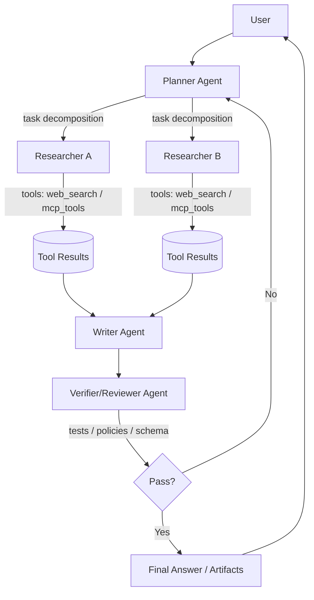
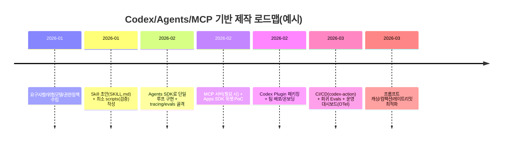

# Codex 스킬·플러그인·멀티 에이전트 제작 가이드와 참고 리포트

## 실행요약
Codex 제작은 **(1) Skill로 워크플로를 “표준화”**하고 **(2) Plugin으로 “배포”**하며 **(3) MCP/Apps SDK·Agents SDK로 “연결·오케스트레이션”**하는 3층 구조가 핵심이다. 2026년 기준, 테스트(Evals)·추적(Tracing)·권한(Approval)·샌드박스(Sandbox)까지 포함한 운영 설계가 성공률을 좌우한다.

## 개요

### 정의·용어 맵
이 리포트는 “무제한/제약 없음”을 가정하고, **코딩·업무 자동화 에이전트**를 실제로 “제작→검증→배포→운영”하기 위한 관점에서 용어를 정리한다. (2026-01 이후 자료만 인용)

**Codex**는 로컬/IDE/앱/CI에서 코드 작성·수정·실행까지 포함한 “agentic coding” 워커로 자리잡았고, CLI는  `@openai/codex`로 배포된다.

**Agent**는 LLM이 도구(tool)를 선택·호출하며 반복 루프를 통해 “작업을 끝까지 수행”하는 실행 단위로, OpenAI 쪽에서는 Agents SDK/Agent Builder/Responses API의 조합으로 체계화돼 있다.

핵심 구성 요소는 아래 4개로 수렴한다.

- **Skill(스킬)**: “재사용 가능한 작업 플레이북” (SKILL.md + 스크립트/자산/레퍼런스). Codex에서는 스킬이 워크플로를 정의하는 작성 포맷이며, 필요할 때만 본문을 로딩하는 **progressive disclosure**(메타데이터→필요 시 전문 로드)로 컨텍스트 비용을 줄인다.
- **Plugin(플러그인)**: Codex에서 “설치 가능한 배포 단위”. 스킬 + 앱 연동 + MCP 서버 구성을 한 묶음으로 배포하여 반복 가능한 워크플로를 제공한다.
- **MCP(Model Context Protocol)**: 외부 도구/리소스/데이터(그리고 Apps SDK에서는 UI까지)를 표준 방식으로 노출시키는 서버-클라이언트 프로토콜 계층. Apps SDK는 ChatGPT 내 “위젯 UI”까지 MCP로 운반한다.
- **멀티 에이전트 오케스트레이션**: 하나의 거대한 프롬프트 대신, 역할이 분리된 에이전트들이 계획·실행·검증·합성 작업을 분담하고, handoff/manager 패턴으로 조정한다(Agents SDK가 이 프리미티브를 표준 제공).

## 2026년 이후 “플러그인”의 의미 변화
2023년의 “ChatGPT Plugin(openapi + ai-plugin.json)” 생태계는 2026년 기준 본질적으로 **Apps SDK + MCP 기반 앱(위젯 포함)** 및 **Codex 플러그인(스킬/앱/MCP 묶음)**으로 재정렬됐다. Apps SDK changelog에는 “승인된 앱이 Codex 배포를 위해 플러그인으로 전환되며, 당분간 플러그인은 Codex에서만 제공”된다는 가이드가 명시돼 있다.

따라서 이 문서에서 “플러그인”은 주로 **Codex plugin**을 의미하고, ChatGPT 측 확장은 **Apps SDK 앱(= MCP 서버 + 위젯 UI)**로 다룬다.

## 아키텍처와 설계 패턴

### 단일 에이전트 vs 멀티 에이전트
2026년의 실무 관점에서 “단일/멀티” 선택은 기능이 아니라 **품질·안전·운영성**의 트레이드오프다.

**단일 에이전트**는 “한 에이전트 루프 + 도구(tool) 세트”로 해결한다. 장점은 단순성과 비용(호출 수↓), 단점은 복잡도가 올라갈수록 프롬프트/상태/검증 로직이 비대해지며 실패 원인 추적이 어려워진다. OpenAI도 “모델이 도구를 제안하고 플랫폼이 실행, 결과가 다음 스텝에 입력되는 tight loop”가 기본이라고 설명한다.

**멀티 에이전트**는 역할을 분해한다. 예: Planner(계획)–Researcher(수집)–Writer(합성)–Messenger(전달) 같은 “전문화된 팀”이 대표적이며, 실제 구현 사례에서도 4개 역할 분리가 자주 등장한다.

학술 문헌에서도 멀티 에이전트의 핵심 난제로 “조정(assignment/coordination)과 품질 보증(verification)”을 지적하며, 계획-실행-검증형 오케스트레이션을 제안한다.

### 통신·조정 방식의 실무 패턴
멀티 에이전트 구현은 결국 “메시지 패싱”을 어떤 토폴로지로 구성하느냐로 귀결된다(병렬/순차/계층/하이브리드). 이를 공식화해 “토폴로지 라우팅이 모델 선택보다 성능을 지배”한다고 주장하는 2026년 연구도 있다.

실무에서 가장 재현성이 높은 패턴은 다음 3종이다.

- **Manager–Worker(계층형)**: Manager가 작업을 분해하고, Worker들이 증거/산출물을 만들고, Manager가 합성/판정한다. “board of directors” 형태로 orchestrator 1 + specialist N의 구조가 실전 예시로 소개된다.
- **Plan–Execute–Verify(순차+검증)**: Planner가 “실행 계획(ExecPlan)”을 만들고, Executor가 수행, Verifier가 체크리스트/테스트/정적 분석으로 통과 여부를 판정한다. Codex 생태계에서는 계획 문서/규칙 문서(AGENTS.md 등)를 통한 반복 가능성 확보가 강조된다.
- **Parallel Search + Synthesis(병렬+합성)**: 여러 에이전트가 병렬로 근거를 수집·요약하고, 최종 합성 에이전트가 일관된 리포트를 생성한다. “deep research machine” 사례가 이 전형에 가깝다.

### 에이전트 상호작용 흐름(머메이드)
아래는 “Planner–Researcher–Writer–Reviewer(Verifier)–Runner”의 일반형 흐름이다(도구 호출·권한 승인 포함).



이 구조를 운영 가능하게 만들려면, **(a) 도구 권한 승인(approval)**, **(b) 추적(tracing)**, **(c) 평가(evals)**가 필수 축이다.

## Codex 스킬과 플러그인 제작 가이드

### 스킬 개념과 작성 포맷
스킬은 “버전 관리되는 파일 번들 +  `SKILL.md` 매니페스트”로 정의된다. API 관점에서는 스킬을 업로드하고(디렉토리 multipart 또는 zip) 실행 환경에 마운트해 재사용한다.

Codex 관점에서는 스킬이 워크플로를 정의하고, 필요 시에만 전문을 불러오는 progressive disclosure로 컨텍스트 비용을 관리한다.

**스킬 디렉토리 최소 구조(권장)**
-  `SKILL.md`: 필수(프런트매터  `name`,  `description` 포함)
-  `scripts/`: 선택(검증/생성/보정 스크립트)
-  `assets/`,  `references/`: 선택(템플릿/문서/샘플)

#### 예시: SKILL.md 템플릿
```md
---
name: pr-review-and-fix
description: PR 변경분을 리뷰하고, 재현 가능한 이슈만 수정 PR-ready diff를 만든다. 테스트/린트 실행 후 근거를 남긴다.
---

## 입력
- PR 링크 또는 base/head SHA
- 프로젝트 규칙(AGENTS.md 우선)

## 절차
1) 변경 범위 요약 (파일/모듈 단위)
2) 위험도 높은 변경(보안/데이터/권한/파괴적 변경) 표시
3) 재현 가능한 문제만 수정: 최소 diff 원칙
4)  `tests` 실행 후 결과를 기록
5) 출력은 (a) 변경 요약 (b) 수정 diff (c) 테스트 로그 요약 (d) 남은 리스크
```

스킬이 “잘 라우팅”되려면  `description`이 결정적이다(범위·트리거·비적용 조건까지 명시). 이 포인트는 OpenAI의 스킬/Agents SDK 블로그에서도 강조된다.

## 스킬 API와 실행 모델(Hosted shell 중심)
OpenAI API에서 스킬은  `/v1/skills`로 생성하고, Responses API의 shell tool 환경에  `environment.type="container_auto"`로 붙인다.“모델은 도구 호출을 제안할 뿐 직접 실행하지 못한다”는 점을 전제로, 플랫폼이 격리된 컴퓨터 환경에서 실행·파일시스템·제한 네트워크를 제공한다.

## 핵심 코드 스니펫: 스킬 생성(개념) + 실행(개념)
(아래는 문서 예시를 바탕으로 한 최소 패턴이며, 실제 파라미터/모델명은 사용 환경에 맞춰 조정)

```bash
# 1) 스킬 업로드(예: zip)
curl -X POST "https://api.openai.com/v1/skills" \
  -H "Authorization: Bearer $OPENAI_API_KEY" \
  -F "files=@./my_skill.zip;type=application/zip"

# 2) Responses + hosted shell에 스킬 마운트(개념)
curl -L "https://api.openai.com/v1/responses" \
  -H "Content-Type: application/json" \
  -H "Authorization: Bearer $OPENAI_API_KEY" \
  -d '{
    "model": "gpt-5.4",
    "tools": [{
      "type": "shell",
      "environment": {
        "type": "container_auto",
        "skills": [{"type":"skill_reference","skill_id":"<skill_id>"}]
      }
    }],
    "input": "스킬을 사용해 테스트를 실행하고 리포트를 생성해."
  }'
```

## Codex 플러그인: 종류·구조·개발·배포·권한
Codex 플러그인은 “재사용 워크플로 번들”이며, (a) 스킬, (b) 앱 연동(외부 서비스 연결), (c) MCP 서버 구성을 함께 묶을 수 있다.

## 플러그인 구조와 매니페스트
Codex 플러그인의 엔트리포인트는  `.codex-plugin/plugin.json`이다. 스킬 폴더( `skills/`), 앱 매핑( `.app.json`), MCP 서버( `.mcp.json`)를 포함할 수 있다.
```json
{
  "name": "my-plugin",
  "version": "0.1.0",
  "description": "Bundle reusable skills and app integrations.",
  "license": "MIT",
  "skills": "./skills/",
  "mcpServers": "./.mcp.json",
  "apps": "./.app.json",
  "interface": {
    "displayName": "My Plugin",
    "shortDescription": "Reusable skills and apps",
    "privacyPolicyURL": "https://example.com/privacy",
    "termsOfServiceURL": "https://example.com/terms"
  }
}
```

## 설치·운영 관점 권한/데이터 공유
플러그인을 설치해도, Codex의 기존 승인(approval) 설정이 적용되며, 외부 앱으로 데이터가 전송될 때는 해당 앱의 약관/프라이버시가 적용된다.

**권장 원칙(실무 체크)**
- 최소 권한(least privilege) + 파괴적 작업은 human confirmation- 네트워크 허용은 allowlist, 기본은 차단(특히 자동화/장시간 작업)- 플러그인/위젯에 전달하는 데이터는 “현재 작업에 필요한 최소 필드만(PII/토큰 금지)”

## 구현 사례, 통합 워크플로, 운영·보안

## 멀티 에이전트 구현 사례(설계·코드·성능·한계)

## 사례 A: OpenAI Agents SDK 기반 멀티 에이전트(Planner–Researcher–Writer–Messenger)
Medium 구현 사례는 4개 역할 분리를 통해 “리서치→합성→전달(이메일)”까지 end-to-end를 구성한다.다만 이런 구조는 (1) 호출 수 증가에 따른 비용/지연, (2) 에이전트 간 컨텍스트 전달 손실, (3) 검증 없는 합성 시 환각 위험이 커진다. 이를 보완하려면 tracer + grader + 반복 제한이 필요하며, trace 기반 보증(assurance) 프레임워크 연구도 2026년에 등장했다.

## 사례 B: Codex 장시간 작업(long-horizon) + 스킬/컴팩션
장시간 작업에서는 **스킬 + hosted shell + compaction** 조합이 핵심 패턴으로 “반복 작업을 스킬로 캡슐화”하고, 컨텍스트는 서버 사이드 compaction으로 제어한다.

OpenAI는 “에이전트가 더 긴 시간 동안 일관성을 유지하며 더 큰 작업 단위를 end-to-end로 완료”하는 것이 실질적 변화라고 설명한다.

## 사례 C: 조직 내부 에이전트(데이터 에이전트) – 접근 채널 다변화
OpenAI 내부 데이터 에이전트 사례는, 에이전트가 **Slack/웹/IDE/Codex CLI(MCP)/내부 ChatGPT(MCP connector)** 등 다양한 채널로 노출되며, Agent API가 내부 데이터/컨텍스트와 모델을 연결하는 구조를 제시한다.이 사례는 “플러그인/커넥터”를 단순 기능이 아니라 **배포 채널**로 보고, 동일한 도메인 로직을 다중 인터페이스에서 재사용하는 설계의 중요성을 보여준다.

## 통합 워크플로·CI/CD·테스트 전략

## CI/CD: Codex GitHub Action `openai/codex-action`는 GitHub Actions에서 Codex CLI를 실행하며, 프록시를 통해 Responses API를 호출하고, 권한을 제한하는 “safety-strategy(drop-sudo 등)”를 제공한다.특히 네트워크가 기본적으로 제한되는 Codex 샌드박스 특성상, 의존성 다운로드는 Codex 실행 전 단계로 분리하는 가이드가 명시돼 있다.

## 테스트/Evals: “스킬을 테스트 가능한 단위로 만들기”
스킬을 운영에 넣으려면 “테스트 케이스·점수·회귀”가 필요하고, OpenAI는 스킬을 체계적으로 평가(Evals)하는 접근을 별도 가이드로 제시한다.Agent Builder에서도 trace 기반 graders로 워크플로를 평가하는 흐름이 포함된다.

## 권장 테스트 매트릭스(현업형)
- **기능 테스트**: 동일 입력→동일 산출물(구조/스키마/필수 섹션)
- **도구 호출 테스트**: 허용/거부/타임아웃/부분 실패/재시도 정책
- **보안 테스트**: prompt injection 시나리오(외부 콘텐츠/메일/문서) + write action 차단/승인 흐름
- **회귀 테스트**: 모델/버전 업 시 동일 Evals 세트 통과(Changelog 기반 변경 추적 포함)

## 운영·모니터링·비용·규모화 고려사항

## 관측 가능성(Tracing)과 감사(Audit)
Agents SDK는 tool calls/handoffs/guardrails 등 실행 이벤트를 포괄적으로 추적하는 built-in tracing을 제공한다.또한 OpenTelemetry 기반으로 Agents SDK 트레이스를 외부 관측 도구로 내보내는 통합이 존재한다(예: 공식 OTel instrumentation 레포).

## 비용 최적화: 컨텍스트·캐싱·요청 수
Prompt Caching은 반복 프롬프트의 prefix를 재사용해 지연·비용을 줄이며(최대 80% 지연, 90% 입력 비용 절감 수치가 문서/쿡북에 제시), 긴 워크플로에서는 “정적 내용은 앞쪽/변동 내용은 뒤쪽” 배치가 권장된다.Rate limit(RPM/TPM) 제약 하에서는 배칭/요청 수 감소가 일반적 최적화로 제시된다.

## 장시간 작업: 컴팩션·상태 분리
서버 사이드 compaction은 렌더 토큰이 임계치를 넘을 때 자동으로 수행되는 패턴이 소개돼 있고, 장시간 에이전트에서 컨텍스트 폭증을 완화하는 축으로 쓰인다.

## 법적·윤리적·보안 이슈(요약)
2026년의 핵심 이슈는 “모델이 똑똑해져서 안전해지는가?”가 아니라, **시스템이 조작돼도 피해가 제한되도록 설계됐는가**다. OpenAI는 prompt injection이 사회공학 형태로 진화해 “필터링만으로는 부족하며, 성공하더라도 영향이 제한되게 설계해야 한다”는 관점을 제시한다.운영 관점에서 “행동 모니터링”은 산업 표준이 되어야 한다는 주장도 나온다. OpenAI는 내부 코딩 에이전트에 대해 행위/추론 기반 모니터링으로 위험 행동을 탐지·분류·경보하는 시스템을 설명한다.Apps SDK에서는 데이터 처리·로그·OAuth·네트워크·위젯 CSP 등 보안/프라이버시 원칙을 구체화하고 있으며, 특히 write action·prompt injection·로그 PII redaction·CSP 제한을 명시한다.

## 비교표, 체크리스트, 템플릿

## 기술 비교 표(기술·라이선스·장단점)
| 기술/프로젝트 | 목적(한 줄) | 핵심 프리미티브 | 라이선스 | 장점 | 단점/주의 | 신뢰도 |
|---|---|---|---|---|---|---|
| Codex Skills | 반복 워크플로를 “작성 포맷”으로 표준화 |  `SKILL.md` + scripts/assets + progressive disclosure | 스킬별 상이(카탈로그는 개별 LICENSE)| 팀 규칙을 실행 단위로 캡슐화, 컨텍스트 효율| description 설계 실패 시 라우팅 불안정| 높음 |
| Codex Plugins | 스킬+앱+MCP를 “설치 가능한 배포 단위”로 묶음 |  `.codex-plugin/plugin.json`,  `skills/`,  `.app.json`,  `.mcp.json`| (플러그인별 상이) | 재사용/배포/온보딩 단순화| 외부 앱 데이터 전송 시 약관/프라이버시 적용, 승인 정책 설계 필요| 높음 |
| OpenAI Agents SDK (Python) | 멀티 에이전트 워크플로를 코드로 구축 | Agent/Runner/Sessions/Handoffs/Guardrails/Tracing| MIT| 생산용 프리미티브(추적/세션/가드레일) 기본 제공| 아키텍처 과설계 시 비용↑, 검증 없이 합성 시 환각 위험| 높음 |
| OpenAI Agents SDK (JS/TS) | 웹/TS 스택에서 동일 패턴 구현 | Provider-agnostic + 예제/릴리즈 활발| (레포 기준) | TS 생태계 친화, 멀티 에이전트·보이스까지 확장| 버전 변화 빠름(릴리즈/이슈 기반 운영 필요)| 높음 |
| Apps SDK + MCP(챗 UI) | ChatGPT 안에서 “도구+UI 위젯” 앱 제작 | MCP server + widget resources + state mgmt| (예제 레포 MIT)| 대화형 UI/상태/인증/배포 가이드 체계| 보안/프라이버시·CSP·OAuth·write action 리스크 관리 필수| 높음 |
| MCP SDK들(TypeScript/Python 등) | 표준 프로토콜로 도구/리소스 노출 | tools/resources/prompts, transports(stdio/SSE/HTTP)| (SDK별 상이) | 한 번 만든 서버를 여러 host에서 재사용 가능| tool 정의가 컨텍스트를 잠식(“context bloat”) 가능| 중간 |
| LangGraph | 그래프 기반 상태머신형 에이전트 | stateful nodes/edges, long-running flows| (Repo 표기 기준) | 제어·재실행·관측에 강함(Flow)| 설계 복잡도↑, 러닝커브 | 중간 |
| Microsoft AutoGen | 멀티 에이전트 대화 프레임워크 | conversable agents, team/tool orchestration| (Repo 표기 기준) | 연구/실험에 강함 | 릴리즈가 2025 중심(2026 이후 운영 시 커밋/로드맵 확인)| 중간 |

> 참고: 위 표는 “대표 프로젝트/도구” 위주로 비교했으며, Codex/Agents/Apps SDK는 2026년 changelog·릴리즈 기반으로 최신화가 확인된다.

## 구현 단계별 체크리스트
| 단계 | Item | Value(권장) | Risk | Evidence |
|---|---|---|---|---|
| 설계 | Use-case 적합성 | “규칙 기반으로 어려운 복잡 작업/비정형 데이터/긴 작업”에 우선 적용 | 단순 작업에 에이전트 과잉 적용 | 장시간·에이전트 환경 가이드(컴퓨터 환경/장시간 작업)|
| 설계 | 단일 vs 멀티 | MVP는 단일→필요 시 manager-worker/plan-execute-verify로 확장 | 멀티로 시작 시 비용·복잡도 폭증 | 멀티 에이전트 토폴로지/오케스트레이션 연구|
| 구현 | Skill 작성 | SKILL.md(트리거·비적용 조건) + scripts(검증) | 라우팅 불안정 | 스킬 운영 사례(설명/메타데이터 강조)|
| 구현 | Plugin 패키징 |  `.codex-plugin/plugin.json` + skills + mcp/app 옵션 | 배포 표준 미준수 | 플러그인 구조/매니페스트 규칙|
| 통합 | MCP/Apps SDK | MCP server + 위젯 + 상태 분리(비즈니스/ UI/ durable) | 상태 꼬임/데이터 노출 | Apps SDK 예제·상태관리 가이드|
| 테스트 | Evals/Trace grading | 스킬/워크플로 단위 스코어링 + 회귀 | 모델업데이트로 성능 붕괴 | 스킬 Evals 가이드/Agent Builder 평가|
| 운영 | Tracing/OTel | tracing on + OTel export(선택) | 장애 원인 불명 | Agents SDK tracing/OTel instrumentation|
| 보안 | Sandbox/Approval | 기본 deny + allowlist + write는 승인 | prompt injection/데이터 유출 | Codex sandbox/approval, prompt injection 설계|
| 비용 | 캐싱/컴팩션 | prompt caching + compaction + 요청수 최소화 | 비용 폭주/지연 | Prompt caching 201, compaction 가이드|

## 구현 타임라인(머메이드)


## 템플릿: README·아키텍처 다이어그램(머메이드)·핵심 예제 코드

## README 템플릿(발췌)
```md
# <Project Name>: Codex Skill + Plugin + Agents SDK

## 목적
- 어떤 업무를 자동화/보조하는가
- 성공 기준(SLO/품질/정확도/보안)

## 구성
- skills/<skill-name>/SKILL.md
- .codex-plugin/plugin.json
- mcp/ (optional)
- agents/ (Agents SDK runner)

## 보안
- 승인 정책(approval), sandbox_mode, 네트워크 allowlist
- write action은 반드시 human confirmation

## 테스트
- evals/ (케이스, 기대결과, 스코어)
- 회귀 기준(모델/버전 변경 시)

## 운영
- tracing, OTel export, 비용(캐싱/컴팩션) 전략
```

## 아키텍처 다이어그램(머메이드)
```mermaid
flowchart LR
  subgraph Dev["Developer Workspace / CI"]
    C[Codex CLI / Codex Action] --> S[Skills (SKILL.md + scripts)]
    C --> P[Codex Plugin (.codex-plugin/plugin.json)]
  end

  subgraph Runtime["Agent Runtime"]
    A[Agents SDK Runner] -->|handoff| A2[Specialist Agents]
    A -->|tool calls| M[MCP Server]
    A -->|shell| H[Hosted Shell container_auto]
  end

  subgraph ChatGPT["ChatGPT Surface"]
    W[Apps SDK Widget UI] <---> M
  end

  P --> C
  M --> W
  S --> H
  A --> H
```

---

## 출처 카탈로그와 신뢰도
> 신뢰도 기준: **높음=공식 문서/공식 GitHub/공식 발표/학술 1차**, **중간=유명 OSS/표준 org/검증된 기술 블로그**, **낮음=개인 경험담·근거 빈약(본 리포트에서는 최대한 배제)**
> 사용자 요청에 따라 2026-01 이후 문서/게시물만 포함(일부 “공식 문서”는 게시일 미표기이지만, 2026년 changelog 및 2026-03-30 접근 기준으로 최신 문서로 취급).

## 공식 OpenAI 문서·블로그(우선)
- Codex changelog(플러그인/스킬 기능 업데이트) — 높음- “Using skills to accelerate OSS maintenance”(스킬/설명 설계 포인트) — 높음- “Shell + Skills + Compaction”(장시간 에이전트 패턴) — 높음- “Testing Agent Skills Systematically with Evals”(스킬 평가) — 높음- “Run long horizon tasks with Codex”(장시간 작업 관점) — 높음- “From model to agent: … computer environment”(shell/격리 실행 환경) — 높음- “Designing AI agents to resist prompt injection”(보안/사회공학 관점) — 높음- “How we monitor internal coding agents for misalignment”(운영 모니터링) — 높음- Apps SDK guides(보안/프라이버시/상태/제출) — 높음- Apps SDK changelog(플러그인 배포 가이드 포함) — 높음- API changelog(Responses/기능 변화 추적) — 높음

## OpenAI GitHub (주요 10개 이상)
- openai/codex (Codex CLI; 릴리즈 2026-03-26 확인) — 높음- openai/skills (스킬 카탈로그; 2026-03 커밋 활발) — 높음- openai/openai-agents-python (Agents SDK; 릴리즈 2026-03-26) — 높음- openai/openai-agents-js (Agents SDK JS/TS; 릴리즈 2026-03-25) — 높음- openai/openai-apps-sdk-examples (Apps SDK 예제/위젯/MCP 서버) — 높음- openai/codex-action (CI에서 Codex 실행, 권한 제한) — 높음- (보조) openai-agents-js 예제 파일(tool search/provider) — 높음- (보조) openai-agents-js PLANS(계획 문서 관행) — 높음- Codex llms-full.txt(문서 스냅샷; 2026-03-01) — 높음- (추가로 제작 시 참고) Codex SDK 문서(프로그램 제어) — 높음

## MCP 표준·SDK·레퍼런스 GitHub
- modelcontextprotocol 조직/개요 — 중간(표준 org)- modelcontextprotocol/typescript-sdk — 중간- modelcontextprotocol/python-sdk — 중간- modelcontextprotocol/servers(레퍼런스 서버; “교육용, prod 아님” 경고 포함) — 중간- ext-apps/specification/2026-01-26/apps.mdx (MCP Apps spec) — 중간

## Medium(주요 10개 이상, 2026-01 이후)
- Saurabh Singh, “Building Production-Ready AI Agents in 2026 …”(아키텍처/세션) — 중간- Johni Douglas Marangon, “Building Multi-Agents with OpenAI Agent SDK”(핵심 기능 요약) — 중간- Paolo Perrone, “12 Best AI Agent Frameworks in 2026”(프레임워크 비교) — 중간- Mark Chen, “Codex App … Skills Library …”(스킬 스타터 맵) — 중간- Sujeeth Shetty, “Multi-Agent ‘board’ via Agents SDK”(오케스트레이터 패턴) — 중간- unicodeveloper, “10 Must-Have Skills …”(스킬 생태계 관점) — 중간- Sebastian Buzdugan, “What Is OpenAI Codex? Skills, Automations …”(스킬/자동화 프리미티브 관점) — 중간- Kapil Khatik, “Stop Hard-Coding AI Tools … MCP”(MCP tutorial) — 중간- Sohail Saifi, “MCP … Hidden Standard …”(MCP 개요/동향) — 중간- Waleed Kadous, “How to Extend Your AI in 2026 …”(확장 방식 의사결정·context bloat 경고) — 중간- Ouarda FENEK, “Deep Research Machine”(멀티 에이전트 워크플로) — 중간- Rajit Saha, “Framework Wars …”(Flow vs Crew 하이브리드 관점) — 중간

## 관련 학술 논문(있으면, 2026-01 이후)
- Verified Multi-Agent Orchestration(조정/검증 문제) — 높음(학술 1차)- Orchestration of Multi-Agent Systems(통합 아키텍처 프레임) — 높음- AdaptOrch(토폴로지 라우팅) — 높음- Trace-Based Assurance Framework(추적 기반 평가/보증) — 높음- Evaluating Contextual Privacy Across Agentic Workflows(프라이버시 평가) — 높음- Agent Skills for LLMs(스킬 아키텍처/보안) — 높음
