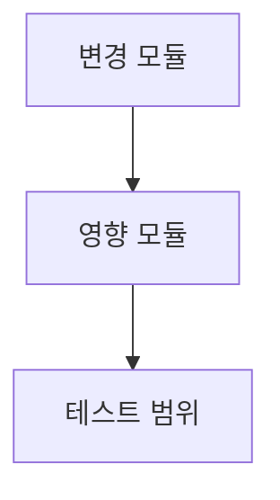

# 구현 계획 수립

## Use This Skill When

- coding has not started and the main task is to define scope, approval, and
  architecture
- the user asks how to implement something or wants a plan document before
  execution
- file changes, dependencies, Mermaid diagrams, and test strategy need to be
  written down before work begins

## Prefer Another Skill When

- the user wants planning plus implementation through release: use
  `mstack-pipeline`
- code or a diff already exists and needs inspection: use `mstack-review`
- the main task is verification only: use `mstack-qa`

계획은 실행 전에 범위와 위험을 고정하는 문서다. 구현을 바로 시작하기 전에 다음을 정리한다.

## Phase 1: Business Review

### 1.1 문제 정의
- 현재 상태 vs 목표 상태를 한 문장으로 쓴다.
- 영향 범위를 정량 지표로 적는다.

### 1.2 제안 옵션
최소 2개, 최대 3개 옵션을 표로 비교한다.

| 옵션 | 설명 | 공수(일) | 리스크 | 비용(AED) |
|------|------|---------|--------|----------|
| A    |      |         |        |          |
| B    |      |         |        |          |

### 1.3 추천 & 근거
- 추천 옵션과 이유를 3줄 이내로 적는다.
- 실패 시 롤백 전략을 한 줄로 적는다.

### 1.4 승인 요청
`[ ] Phase 1 승인` 체크박스를 남긴다.
승인 전까지는 Phase 2를 쓰지 않는다. 사용자가 한 번에 작성하라고 명시하면 예외로 한다.

## Phase 2: Engineering Review

### 2.1 Mermaid 다이어그램

변경되는 모듈 간 관계를 Mermaid `graph TD` 또는 `sequenceDiagram`으로 그린다.

### 2.2 파일 변경 목록

| 파일 | 변경 유형 | 설명 |
|------|----------|------|
| `src/foo.py` | modify | 함수 X 추가 |
| `tests/test_foo.py` | create | X에 대한 단위 테스트 |

`create` 파일은 기존 이름과 충돌하지 않도록 확인한다.
충돌이 있으면 대체 파일명을 계획에 적고, 실행자가 임의로 이름을 바꾸지 못하게 한다.

### 2.3 의존성 & 순서
- 작업 간 의존 관계를 명시한다.
- 병렬 작업이 가능하면 독립 경로와 순서를 분리한다.
- 공유 모듈이 있으면 선행 작업과 승인 지점을 분리한다.

### 2.4 테스트 전략
- 단위 테스트: 어떤 함수/메서드를 커버하는지 적는다.
- 통합 테스트: 필요 여부와 범위를 적는다.
- 기존 테스트 중 깨질 가능성이 있는 것을 적는다.

### 2.5 리스크 & 완화
- 기술 리스크를 성능, 호환성, 보안 관점으로 나눠 적는다.
- 각 리스크의 완화 전략을 한 줄로 적는다.

## 출력

계획 문서를 `plan.md`로 저장한다. 파일이 이미 있으면 날짜 접미사를 붙인다.
계획에는 범위, 승인 지점, 위험, 검증 경로를 명확히 남긴다.

## Coordinator Input Packet

- When the plan still contains multiple viable implementation paths, produce a
  coordinator-ready packet instead of forcing a single narrative recommendation.
- The packet must contain: `objective`, `non-negotiables`, `acceptance criteria`,
  `option set`, `required evidence`, `test expectations`.
- Recommend `pipeline-coordinator` when the packet contains `3+ options` or a
  high-blast-radius trade-off.

## Guardrails

- 공유 모듈은 별도로 표시한다.
- 테스트가 없는 새 함수는 계획에서 바로 드러내도록 적는다.
- 구현과 무관한 세부 설명은 줄이고, 실행 가능한 항목만 남긴다.
